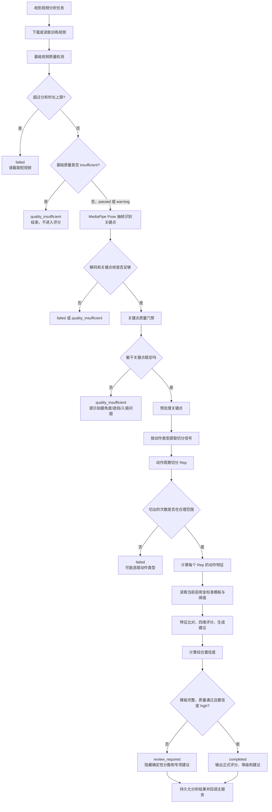
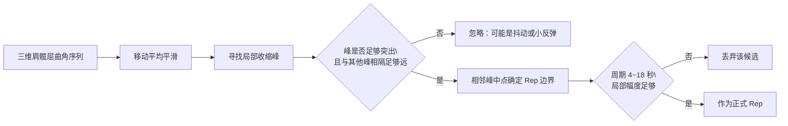
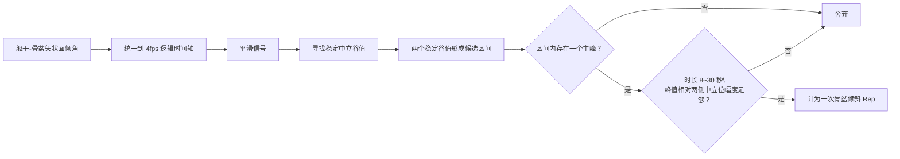
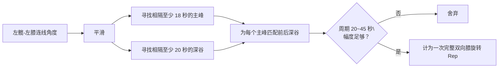

# 动作分析、视频切分与评分逻辑（当前代码实现）

本文按“一条视频如何变成动作次数、分数和建议”梳理当前实现。**Rep** 指一次被识别出的动作周期；**切分**负责找动作边界，**评分**负责评估该周期的质量，两者不等同。实现入口见 `services/analysis-service/app/tasks/analyze_video.py`；各动作规则见 `services/analysis-service/app/core/phase_segmenter.py` 和 `services/analysis-service/app/core/calculators/__init__.py`。

以下配置为仓库 `.env` 与 `.env.production` 当前值；`Settings` 代码内的回退默认值不一定相同（例如缩腹切分回退默认值为 `legacy_peak`），运行时以实际环境变量为准：

| 配置项 | 当前值 | 实际含义 |
|---|---|---|
| 最大视频时长 | 300 秒 | 超过 5 分钟返回 `failed`，要求截取视频；不是评分不合格。 |
| 最大推理帧数 | 1200 帧 | 防止长视频、高帧率视频耗尽服务器 CPU/内存。 |
| 姿态推理最大宽度 | 720 px | 高分辨率视频会等比例缩小后再送入 MediaPipe。 |
| 缩腹切分模式 | `shadow` | **正式结果仍使用旧的峰值切分**；同时额外运行新版闭环状态机，只保存差异诊断，不影响患者当前分数和次数。 |
| MediaPipe 模型复杂度 | 1 | 平衡识别效果与 CPU 资源消耗。 |

---

# 1. 当前动作分析完整流程



---

# 2. 分析过程逐步说明

| 阶段 | 当前代码实际做什么 | 关键规则 | 失败后的结果 |
|---|---|---|---|
| 1. 视频元数据检查 | 使用 `ffprobe` 读取视频流、分辨率、帧率、时长；失败时回退 OpenCV。 | 宽度 < 480、或高度 < 360、或源帧率 < 15、或时长 < 10 秒视为质量不足；超过分析时长上限单独拦截。 | 前几项为 `quality_insufficient`；超过 300 秒为 `failed` |
| 2. 画面基础检查 | 从视频约 10%、30%、50%、70%、90% 位置抽样，检查画面亮度。 | 各帧转灰度取像素均值，再对成功读取帧求平均；< 45 为过暗、> 235 为过亮，标记 `warning`；无法读取抽样画面则标记 `insufficient`。 | 亮度异常最终可能转 `review_required`；画面不可读为 `quality_insufficient` |
| 3. 姿态识别 | 使用 MediaPipe Pose，逐帧识别肩、髋、膝、踝 8 个关键点。 | 每个关键点保存 `x/y/z` 坐标和 `visibility` 可见度。 | 提取帧 < 10 时为 `failed` |
| 4. 解码完整性检查 | 比较视频声明时长与提取帧所覆盖的时长。 | 覆盖率应 ≥ 95%；与 4fps/10fps 姿态抽样频率不同。 | 不足时为 `quality_insufficient` |
| 5. 关键点质量门禁 | 检查左右肩、左右髋等躯干关键点是否长期稳定存在。 | 单帧关键点可见度要求 ≥ 0.5；四个关键躯干点同时可用的帧占比要求 ≥ 70%。 | `quality_insufficient`，记录 `TRUNK_KEYPOINTS_UNSTABLE` |
| 6. 关键点预处理 | 对低置信度点标记缺失、短暂丢失进行插值、平滑轨迹、按肩宽缩放、以初始髋中点平移坐标。 | 两个有效点之间的原始帧索引间隙超过 10 帧不插值，避免把遮挡或离镜“伪造成连续动作”。 | 无法满足关键点门禁时提前结束 |
| 7. 视频切分 | 根据动作类型，从关键点序列中寻找完整动作周期。 | 每个周期输出 `start / execute / hold / return` 等关键帧。 | 未切出 Rep，或次数不合理时为 `failed` |
| 8. 特征计算 | 对每个 Rep 计算幅度、速度、稳定性、保持时间、对称性等。 | 不同动作使用不同指标；实际产生并参与比对的特征若缺模板或数值非法，则标为待复核。 | 相关特征的模板缺失/值非法可能转 `review_required` |
| 9. 模板比对与评分 | 将特征和当前启用的金标准模板、阈值版本比较，再汇总四维分。 | `normal / warning / invalid / review_required`。 | 数据不可靠时转 `review_required` |
| 10. 建议和回调 | 仅针对多次重复的问题生成最多两条建议，保存结果后回调主服务。 | 单次偶发异常不作为整段训练的问题。 | 回调失败会保存 payload 并自动重试 |

---

# 3. 视频切分的核心概念

系统不会直接把“视频长度”平均切成几段，而是先从人体关键点里生成一条随时间变化的**动作信号曲线**，再根据这条曲线找出动作周期。

一个 Rep 可以理解为：

```text
静止准备
  → 开始动作
  → 到达动作顶点
  → 回到中立位置
  → 再次稳定
```

不同动作的“顶点”定义不同，所以切分信号不同。

| 动作 | 切分时使用的信号 | 该信号表达什么 | 评分时主要使用的信号 |
|---|---|---|---|
| 缩腹 | 肩中点到髋中点的三维屈曲角 | 上半身相对骨盆发生收缩/屈曲时的变化 | 收腹幅度、收缩速度、保持时间、躯干变化 |
| 骨盆倾斜 | 髋中点到肩中点的矢状面有符号倾角 | 侧方画面中，躯干—骨盆相对竖直方向的前后倾变化 | 髋线倾斜幅度、骨盆横移、躯干残余晃动、保持时间 |
| 膝关节旋转 | 左髋到左膝连线的角度 | 一次“屈膝 → 左右旋转 → 回正”的大周期变化 | 双膝横向旋转幅度、左右对称性、速度、躯干稳定性 |

> **很重要：切分信号与评分信号并不完全相同。**
>
> 切分的目标是“这一段是不是一次完整动作”；评分的目标是“动作质量怎么样”。
>
> 例如膝关节旋转使用“髋—膝角度”找完整大周期，但评分时主要观察“双膝中点横向移动幅度”和“左右对称性”。

---

# 4. 共同的切分前置校验

在真正找峰值之前，系统会先判断视频中的动作信号是否有足够变化。

| 动作 | 切分信号最小有效摆幅 | 不满足时的判断 | 患者/任务结果 |
|---|---:|---|---|
| 缩腹运动 | ≥ 0.5° | 躯干收缩信号几乎没有变化 | `failed`，提示所选动作类型与视频不匹配 |
| 骨盆倾斜 | ≥ 2.0° | 骨盆/躯干前后倾变化过小 | `failed`，提示动作类型可能选错 |
| 膝关节旋转 | ≥ 15.0° | 没有足够明显的膝部大周期变化 | `failed`，提示动作类型可能选错 |

当信号长度 ≥ 20 帧时，使用 **95% 分位数 − 5% 分位数** 的稳健极差；少于 20 帧时使用最大值 − 最小值。这样可尽量忽略个别帧的突刺噪声。三个最小摆幅是 `PhaseSegmenter._MIN_SIGNAL_RANGE` 中按动作设置的经验门槛（代码注释列出了参考观察），**不是每条视频动态学习得到，也不是评分的正常/异常阈值**。通过该门槛仅表示信号有机会被切分，不等于动作合格。

---

# 5. 缩腹运动：当前切分逻辑

## 5.1 当前正式使用的逻辑：`legacy_peak`

虽然配置是 `shadow`，但缩腹的正式计数和正式评分仍由 `legacy_peak` 得出。

### 切分过程

| 步骤 | 当前实现 |
|---:|---|
| 1 | 对每帧计算“肩中点—髋中点三维向量相对竖直方向的屈曲角”。 |
| 2 | 对信号做移动平均平滑，减少关键点抖动。 |
| 3 | 使用 `find_peaks` 检测局部峰值，认为每个显著的收缩峰是一个动作候选。 |
| 4 | 相邻两个峰之间的中点作为周期边界；严格模式中的第一个/最后一个候选分别以视频首/尾为边界，再做时长和幅度校验。 |
| 5 | 校验一个周期的时长、动作幅度；不满足条件则丢弃。 |
| 6 | 如果严格峰值切分一个 Rep 都找不到，则进入较保守的回退峰值切分。 |
| 7 | 如果回退切分出现过短周期，过滤；若出现过长周期，会优先在内部谷值处拆分。 |

### 缩腹的峰值规则

| 项目 | 当前规则 | 含义 |
|---|---|---|
| 平滑 | 自适应移动平均窗口，最大 5 帧 | 减少单帧关键点误差造成的假峰。 |
| 最小峰间距 | `int(3.5 × effective_sample_fps)` 帧（至少 1 帧） | 同一次收缩内相隔过近的两个小峰，会倾向于合并。 |
| 峰显著性 | `max(0.30°, 信号标准差×0.12, 稳健摆幅×0.12)` | 峰必须有足够高度，不能只是轻微波动。 |
| 最短 Rep 时长 | 4 秒 | 太短更可能是抖动、呼吸或调整动作。 |
| 最长 Rep 时长 | 18 秒 | 太长则可能是多个动作合在一起或患者停留太久。 |
| 最小局部幅度 | `max(0.20°, 稳健摆幅×0.12)` | 每个周期内的收缩幅度必须足够。 |

### 缩腹正式切分图



## 5.2 新版闭环切分：`cycle_state_machine`

新版逻辑已实现，但在当前 `shadow` 模式下只用于**对照诊断**。

它的思路是：不再仅凭“有一个峰”就认为完成一次缩腹，而必须识别完整闭环：

```text
稳定
  → 连续收缩
  → 明确顶点
  → 持续回落
  → 回到稳定
```

| 状态 | 满足条件 | 后续行为 |
|---|---|---|
| `REST` 静止 | 近期信号波动很小 | 等待出现持续上升。 |
| `CONTRACTING` 收缩 | 在至少 0.8 秒内总体持续上升 | 持续寻找真实顶点。 |
| `PEAK` 顶点 | 局部极大值相对起点有足够上升幅度 | 检查是否存在连续回落。 |
| `RETURNING` 回落 | 在至少 0.8 秒内总体持续下降 | 检查是否重新稳定。 |
| `COMPLETE` 完整周期 | 回落后再次稳定，周期 2.5–18 秒且幅度足够 | 计为一次完整 Rep。 |
| `REBOUND` 回弹 | 回落未稳定时出现小幅反弹 | 记录诊断，但不单独计数。 |
| `INCOMPLETE_TAIL` 尾部候选 | 视频在动作尾部结束 | 满足幅度和回落条件时可作为尾部动作接受，否则拒绝。 |

新版缩腹闭环切分的关键配置：

| 配置 | 当前值 | 目的 |
|---|---:|---|
| 最短稳定时间 | 0.6 秒 | 要求动作开始和结束附近存在稳定证据。 |
| 最短收缩时间 | 0.8 秒 | 避免一个瞬时抖动被认成收缩。 |
| 最短回落时间 | 0.8 秒 | 避免顶点后的短暂波动被认成回正。 |
| 最短周期 | 2.5 秒 | 配合闭环条件抑制呼吸和单帧噪声；与旧版的 4 秒门槛不同。 |
| 最长周期 | 18 秒 | 避免一个周期无限延长。 |
| 噪声下限 | 0.20° | 低于该量级的波动不应被当作真实动作。 |
| 候选相对幅度 | 稳健摆幅的 15% | 小幅但完整的患者动作也有机会被识别。 |
| 回弹阈值 | 稳健摆幅的 20% | 回落中的轻微反弹不拆成第二次动作。 |

### 当前 `shadow` 模式意味着什么

| 内容 | 是否影响患者报告 |
|---|---:|
| 旧版 `legacy_peak` 计数 | 是 |
| 旧版切分对应的特征和评分 | 是 |
| 新版闭环状态机计数 | 否 |
| 新旧计数差异 | 否，只写入 `segmentation_snapshot` |
| 回弹、尾部候选等诊断 | 否，仅供管理端或验证工具查看 |
| 切换为新版正式切分 | 需要把 `ABDOMINAL_SEGMENTATION_MODE` 改为 `cycle_state_machine` |

---

# 6. 骨盆倾斜：当前切分逻辑

骨盆倾斜不是简单找一个角度峰，而是要求完整的：

```text
稳定中立位
  → 骨盆后倾达到峰值
  → 回到稳定中立位
```

## 6.1 为什么要使用固定 4fps 逻辑时间轴

视频源帧率、抽样帧率可能不同。骨盆倾斜为了让不同视频的时间规则一致，会在逻辑上统一按 **4fps** 切分。

| 情况 | 处理方式 |
|---|---|
| 输入本来接近 4fps 且时间间隔稳定 | 直接使用当前帧序列切分。 |
| 输入为 6fps、10fps 或采样间隔不均匀 | 根据真实时间戳插值到 4fps 逻辑时间轴，再切分。 |
| 切分完成后 | 将切分边界映射回最接近的真实关键点帧。 |

这避免“同样是 8 秒动作，在 4fps 和 10fps 输入时，因帧数不同被判断成不同长度”的问题。

## 6.2 骨盆倾斜切分规则

| 项目 | 当前规则 | 含义 |
|---|---|---|
| 切分驱动信号 | 躯干—骨盆矢状面倾角 | 在侧方拍摄下反映骨盆前后倾的过程。 |
| 最短 Rep 时长 | 8 秒 | 过短更可能是呼吸、调整或关键点抖动。 |
| 最长 Rep 时长 | 30 秒 | 过长说明动作可能不完整或多个动作混在一起。 |
| 中立位稳定窗口 | 约 0.7 秒 | 起点和终点必须在谷值附近稳定，不是单帧低点。 |
| 幅度阈值 | `max(0.5°, 标准差×0.30, 信号全幅×0.10)` | 峰值相对左右两侧中立位都要有足够变化。 |
| 主峰数量 | 一个周期只允许一个主峰 | 多个峰视为调整、抖动或代偿，不拆成多个动作。 |
| 首尾补偿 | 可将视频首帧/末帧补为中立边界，但必须满足稳定和幅度条件 | 减少第一个或最后一个完整动作被漏掉。 |



---

# 7. 膝关节旋转：当前切分逻辑

膝关节旋转的一次完整动作不是“左边转一下”或“右边转一下”各算一次，而是完整的：

```text
屈膝准备
  → 向一侧旋转
  → 回到中间
  → 向另一侧旋转
  → 回到中间
```

因此，它的切分周期明显比缩腹、骨盆倾斜长。

## 7.1 膝关节旋转切分规则

| 项目 | 当前规则 | 含义 |
|---|---|---|
| 切分驱动信号 | 左髋—左膝连线角度 | 用来识别屈膝和旋转产生的整体大周期。 |
| 峰最小间隔 | 18 秒 | 避免把同一次双向旋转中的左右子峰拆成两次动作。 |
| 谷最小间隔 | 20 秒 | 只保留两次完整动作之间的深谷，忽略一次动作内部“左转回正再右转”的小谷。 |
| 最短 Rep 时长 | 20 秒 | 完成左右双向旋转需要足够时间。 |
| 最长 Rep 时长 | 45 秒 | 太长可能是停顿过久或切分错误。 |
| 幅度阈值 | `max(1.0°, 标准差×0.20, 信号全幅×0.05)` | 主峰相对于前后边界必须存在有效变化。 |
| 相同边界去重 | 不重复使用同一对前后谷值 | 防止同一段动作被重复计数。 |



---

# 8. 动作切分后的次数校验

切分完成后，系统会再次检查次数是否落在当前动作的合理区间中。

| 动作 | 合理次数范围 | 超出范围时的处理 |
|---|---:|---|
| 缩腹运动 | 3–25 次 | 标记为 `failed`，认为视频可能不是所选动作，或切分明显异常。 |
| 骨盆倾斜 | 3–30 次 | 标记为 `failed`。 |
| 膝关节旋转 | 4–20 次 | 标记为 `failed`。 |

系统提示的核心意思是：

> “分析检测到的动作周期数不符合该动作的预期范围，该视频可能与所选动作类型不匹配，请重新选择后上传。”

---

# 9. 切分完成后，如何进入评分

视频被切成 Rep 后，才开始逐次评分。


| 动作 | 切分之后计算什么 | 最终评分重点 |
|---|---|---|
| 缩腹 | 屈曲角 90% 分位数减 10% 分位数作为幅度；上升段角速度中位数；峰附近 ≥85% 幅度的连续平台时长；躯干相对起始帧的角度变化 | 是否真正完成收腹、是否平稳、是否存在明显躯干代偿。 |
| 骨盆倾斜 | 画面平面左右髋连线角度全周期极差；髋中点相对前 3 帧的横向偏移；后倾顶点附近的残余角度晃动；矢状面顶点 ≥85% 幅度的连续保持时长 | **切分用矢状面肩髋倾角，评分幅度用左右髋线画面角度**；两者口径不同，评分指标需匹配模板版本。 |
| 膝关节旋转 | 双膝 X 轴横移幅度（归一化坐标 ×100）、左右对称性、双膝横向速度、躯干变化 | 是否完成双向旋转、左右是否均衡、是否平稳；`knee_rotation_angle` 字段实际是横移百分比，不是角度度数。 |

---

# 10. 当前分析结果的三道安全门

即使切出了动作、算出了分数，也不一定会把分数直接给患者看。

| 安全门 | 判断内容 | 未通过后的状态 | 患者端展示 |
|---|---|---|---|
| 视频质量门 | 分辨率、源帧率、时长、画面可读性、平均关键点可见度；亮度异常单独记为 `warning` | 硬性不通过为 `quality_insufficient`；超分析时长为 `failed` | 提示重新拍摄或截取；单纯亮度警告仍能继续分析，但不能直接给确定性结果。 |
| 关键点门 | 左右肩、左右髋等关键躯干点同时稳定可用帧比例是否 ≥ 70% | `quality_insufficient` | 提示检查拍摄角度、完整入镜与遮挡。 |
| 可信度门 | 模板是否完整、综合置信度是否 `high`、质量状态是否 `passed` | `review_required` | 后台保留计算结果供复核，患者端不展示确定性分数或专项建议；显示“本次训练记录已收到，系统正在复核拍摄和动作信息，请稍后查看结果。” |

综合置信度计算为：

\[
\text{overall} =
0.40 \times \text{视频质量置信度}
+ 0.35 \times \text{关键点置信度}
+ 0.25 \times \text{参数可信度}
\]

| 综合置信度 | 等级 | 是否可直接向患者展示确定性评分 |
|---:|---|---:|
| ≥ 0.75 | `high` | 可以 |
| 0.55–0.749 | `medium` | 不可以，转 `review_required` |
| < 0.55 | `low` | 不可以，转 `review_required` |

---

# 11. 当前实现的关键特点与注意点

| 项目 | 当前实现情况 | 说明 |
|---|---|---|
| 缩腹新版闭环切分 | 已实现 | 可区分完整周期、回落中的局部反弹、视频尾部候选。 |
| 缩腹新版是否已正式生效 | **未正式生效** | 当前 `shadow` 模式下，旧峰值切分仍决定患者报告；新版只保存诊断数据。 |
| 骨盆倾斜时间一致性 | 已处理 | 先统一按 4fps 逻辑时间轴切分，再映射回原始帧。 |
| 膝关节左右旋转 | 按一个完整双向动作计数 | 不会简单地左转一次、右转一次各算一个 Rep。 |
| 长视频处理 | 有帧预算保护 | 不会只分析开头；会通过降低实际抽样率覆盖整段视频，并记录 `effective_sample_fps`。 |
| 切分与评分 | 有意分离 | “怎么判断一次动作开始结束”和“该动作质量怎么样”不使用完全相同的指标。 |
| 低质量结果 | 不直接下结论 | 质量不足重拍；不确定则人工复核。 |
| 次数与训练出勤 | 已解耦 | 切分/评分结果影响有效次数和分数；确认上传后的训练行为仍可用于坚持统计。 |

一句话总结：

> 当前动作分析是“先确保视频和关键点可信，再按动作专用信号切出完整 Rep，随后逐 Rep 计算特征并比对金标准模板；可靠时才输出评分和建议，不可靠时转为重拍或人工复核”。
>
> 其中缩腹的新版闭环切分已经编码完成，但仓库现有环境配置为 `shadow` 对照阶段，尚未接管患者正式计数。

---

# 12. 常见问题：`ffprobe`、亮度、4fps 与 10fps

| 问题 | 当前代码实现 | 容易混淆的地方 |
|---|---|---|
| `ffprobe` 是什么？ | FFmpeg 自带的视频**元数据读取工具**；`video_quality.py` 用 `-show_format -show_streams` 解析视频流、分辨率、源帧率及容器时长。命令不存在、执行失败时改用 OpenCV 读取元数据。 | 不负责人体关键点识别、动作切分或打分；实际逐帧解码及姿态抽样由 OpenCV + MediaPipe 负责。 |
| 亮度如何抽样？ | OpenCV 获取总帧数，对 `int(frame_count × 0.1/0.3/0.5/0.7/0.9)` 所在帧尝试读取；每帧 BGR 转灰度后求像素均值，再对成功读取的均值取平均并计算标准差。平均亮度 < 45 或 > 235 记异常。 | 这是**全局平均亮度**，不是人体局部亮度或逐帧曝光校正；单纯过暗/过亮产生质量 `warning`，最终不能作为 `completed` 的确定结论；抽样完全读不到才是 `insufficient`。 |
| 源视频 15fps 门槛与 4fps/10fps 冲突吗？ | 不冲突：15fps 是上传视频的**原始帧率**质量门槛；4fps/10fps 是对通过质量门的视频进行**姿态推理抽帧**的目标频率。 | 不能把抽帧后 4fps 误判成视频源帧率过低。 |
| 4fps 与 10fps 具体差别？ | 4fps 约每 250ms 看一帧，10fps 约每 100ms 看一帧；理论上 60 秒分别约 240 与 600 次推理，10fps 更易捕获短暂峰值但资源开销更大。 | 这不是切分次数的直接倍率：秒数规则会用 `effective_sample_fps` 换算；骨盆倾斜的**切分逻辑轴固定为 4fps**，而姿态提取可以是 4/6/10fps。 |
| 长视频配置 10fps 会分析整段吗？ | `PoseEstimator` 受 `MAX_ANALYSIS_FRAMES=1200` 预算限制：非骨盆按源帧步长抽样，骨盆按时间戳抽样并放宽时间间隔，尽量覆盖完整视频；实际抽样频率写入 `effective_sample_fps`。 | 300 秒 × 10fps 理论上要 3000 帧，实际不会按 3000 帧完成推理；骨盆默认 4fps，显式传入 10fps 可用于对照回归，但仍受帧预算限制。 |

# 13. 特征比对、评分及建议的具体规则

1. **模板来源**：先使用 `DEFAULT_TEMPLATES` / `DEFAULT_THRESHOLDS` 作为基底，再覆盖数据库当前启用金标准的参考统计值和版本化阈值；调用时显式传入的 `threshold_config` 可覆盖阈值。报告留存模板 ID、版本和阈值快照。模板缺失、数值非有限时，该特征标为 `review_required`，不会当作正常值。
2. **特征标签**：`GoldStandardComparator` 支持 `lower_bound`（越大越好）、`upper_bound`（越小越好）、`two_sided`（双侧区间）。前两种按 `normal_min/warning_min` 或 `normal_max/warning_max` 判定；双侧优先使用版本化 `valid_range/warning_range`，历史模板则结合相对均值的标准差偏离值判定 `normal / warning / invalid`。
3. **单次 Rep 的四维分**：按照 `FEATURE_DIMENSIONS` 归入准确性、稳定性、控制、时长；同维多个指标取均值。默认权重依次是 **40% / 25% / 20% / 15%**；某动作没有某一维时，**只对实际存在的维度重新归一化权重**，不是把缺失维度当 0。达标特征通常为 85～100 分，警告特征最多 80 分，无效特征最多 50 分；准确性特征有 `invalid` 时，总分上限 40，且 `valid_flag=false`。任一比对值要求复核时，该 Rep 标为待复核。
4. **视频分和等级**：视频总分为**所有已评分 Rep 的总分平均**，`valid_reps` 是其中 `valid_flag=true` 的次数；不是只对有效 Rep 求平均。等级为 `≥90 优秀`、`≥75 合格`、`≥60 需改进`、其余 `无效`。是否真正向患者给出分数，还要通过第 10 节的可信度门。
5. **建议生成**：汇总各 Rep 的 `warning/invalid` 问题；2～3 次 Rep 至少重复 2 次，超过 3 次 Rep 则须至少 2 次且占比 ≥25%，才视为视频级反复问题。按出现频次排序，只取前 **2** 个问题，查 `ADVICE_RULES` 生成患者和护士用语；中低置信度不会同时输出确定性的专项建议。

> **置信度实现提示**：`compute_confidence` 的 VQS 实际以可见度和帧数计算，KCS 以可见度、缺失率和轨迹平滑度计算，PRS 以切分次数和传入的有效次数计算。当前任务调用时将 `total_reps` 与 `valid_reps` **都传为切分得到的 Rep 数**，因此这里的 PRS「有效比例」并非随后评分得到的 `valid_flag` 比例；不要把置信度理解为严格的临床动作质量判定。

# 14. 如何对比缩腹的两种切分思路

| 维度 | `legacy_peak`（当前配置下的正式结果） | `cycle_state_machine`（`shadow` 时仅诊断） |
|---|---|---|
| 判定依据 | 显著峰及相邻峰的中点边界，时长/局部幅度过滤；可能接受仅有峰的候选。 | 要求收缩、顶点、回落及稳定闭环；记录回弹、未完成尾段等候选原因。 |
| 可能优点 | 对浅回位谷和较弱信号更宽容；与当前正式报告连续。 | 更容易排除准备动作、局部回弹及未完成周期。 |
| 可能风险 | 局部峰、视频首尾边界可能导致误切/多切。 | 严格闭环条件可能漏掉慢速、小幅或未完全回正但有意义的动作。 |
| 当前可见结果 | 正式 Rep 数、特征、评分、建议。 | `segmentation_snapshot` 中的新旧次数差 `count_delta`、接受/拒绝候选及原因、切分耗时；**不重复姿态提取或产生第二套评分**。 |

**不能只凭算法形式判断哪个好。** 用人工标注的真实患者视频作为参照，覆盖标准动作、弱收缩、呼吸抖动、回弹、视频首尾截断、不同拍摄机位与采样率；比较**次数绝对误差、动作边界偏差、误切率/漏切率、不同 fps 的一致性及耗时**，再检查评分和复核率是否受到影响。当前代码仅提供 `shadow` 并行诊断和差异快照，**不等于已完成临床标注验证，也不能据此断言新版更准确**。相关实现：`analyze_video.py` 中的 `_build_segmentation_snapshot` 与 `phase_segmenter.py` 中的两套缩腹切分方法。
