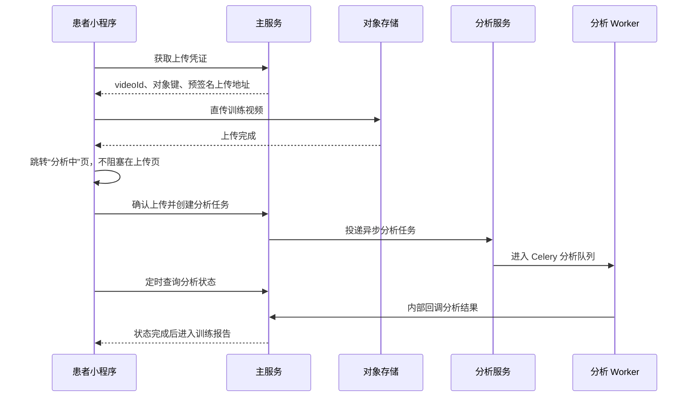
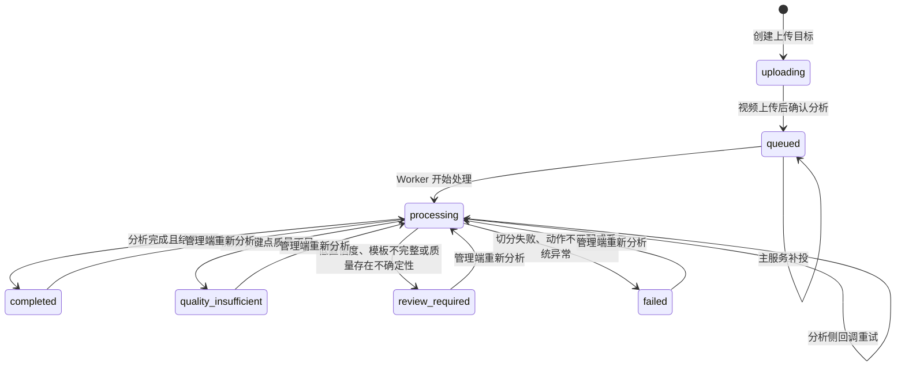

# Home Rehab Motion · 动作分析、评分与患者状态文案梳理

**版本**：V1.0  
**日期**：2026-08-20  
**依据实现**：`services/analysis-service`、`services/main-service`、`apps/patient-miniapp`  
**适用范围**：缩腹运动、骨盆倾斜、膝关节旋转；患者端上传、分析、报告、激励与通知。

---

## 1. 目的与边界

本文用于统一以下口径：

1. 视频从上传到报告的实际状态流转；
2. 三类动作的关键点、切分、特征、模板比较与评分规则；
3. `quality_insufficient`、`review_required`、`failed` 的安全降级规则；
4. 患者端在不同状态下看到的提示、激励与安全文案；
5. 坚持记录与动作质量评分的解耦关系。

> 本系统基于视频图像与姿态估计生成辅助训练反馈，不构成医疗诊断或治疗建议。低质量、低置信度或模板不完整时，系统不得输出确定性的动作质量结论。

---

## 2. 患者上传与异步分析流程

### 2.1 设计说明：上传页不等待服务器分析

当前流程为有意的异步解耦设计，不是页面缺失：患者点击“上传并分析”后，视频先直传对象存储；上传成功即跳转分析页。分析页再执行服务端对象确认、任务创建、排队及进度轮询，避免患者因服务端波动或队列等待而停留在上传页。



### 2.2 状态机



### 2.3 状态、患者展示与业务影响

| 状态 | 患者端主表达 | 是否计入训练日 | 是否展示确定性评分 | 患者主要操作 |
|---|---|---:|---:|---|
| `uploading` | 上传中 | 否 | 否 | 等待上传或重选视频 |
| `queued` | 排队中 | 是 | 否 | 留在分析页或返回首页 |
| `processing` | 分析中 | 是 | 否 | 等待或稍后到历史记录查看 |
| `completed` | 分析完成 | 是 | 是 | 查看报告、建议、进步与徽章 |
| `quality_insufficient` | 视频质量不足 | 是 | 否 | 按拍摄要求重新上传 |
| `review_required` | 本次训练结果待复核 | 是 | 否 | 查看复核说明，按动作指导练习 |
| `failed` | 本次训练暂未生成结果 | 是 | 否 | 稍后查看或重新上传 |

### 2.4 坚持与评分解耦

训练日的记录时机是“视频上传成功并确认分析”，而不是报告完成或评分合格：

```text
确认上传
  → 写入 TrainingAttendance
  → 更新本周训练、连续训练、坚持类徽章进度

分析完成
  → 写入动作评分和报告
  → 计算相对上次的进步
  → 评估质量类徽章（例如首次优秀）
```

同一用户、同一上海自然日只累计一次训练日。质量不足、分析失败和待复核不会回滚当天已经确认的训练记录。

---

## 3. 通用质量、关键点和置信度规则

### 3.1 视频基础质量门禁

| 检查项 | 当前阈值 | 不满足时处理 |
|---|---:|---|
| 分辨率 | 宽 < 480 或高 < 360 | `quality_insufficient` |
| 帧率 | < 15 FPS | `quality_insufficient` |
| 视频时长 | < 10 秒或 > 300 秒 | `quality_insufficient` |
| 平均关键点可见性 | < 0.55 | `quality_insufficient` |
| 亮度 | < 45 或 > 235 | 质量警告，可能导致待复核 |
| 必需躯干点有效帧比例 | < 70% | `quality_insufficient` |

### 3.2 关键点预处理

| 步骤 | 当前规则 | 目的 |
|---|---|---|
| 置信度过滤 | `visibility < 0.5` 视为缺失 | 不让低可信关键点直接驱动动作判断 |
| 缺失插值 | 最长连续缺失 10 帧 | 仅补短时漏检，不伪造长遮挡轨迹 |
| 轨迹平滑 | Savitzky-Golay，窗口 7、三阶 | 降低单帧抖动和假峰 |
| 尺度归一化 | 以肩宽为尺度 | 降低拍摄距离、体型差异影响 |
| 原点归一化 | 首个有效髋中点为原点 | 降低镜头或整体身体平移影响 |

### 3.3 三层置信度

```text
综合置信度 = 视频质量 VQS × 0.40
          + 关键点可靠性 KCS × 0.35
          + 参数可靠性 PRS × 0.25
```

| 指标 | 依据 |
|---|---|
| VQS | 平均关键点可见性、有效帧数量 |
| KCS | 平均可见性、缺失率、轨迹平滑度 |
| PRS | 切分出的动作次数、有效动作比例 |

| 综合置信度 | 级别 | 处理方式 |
|---:|---|---|
| ≥ 0.75 | 高 | 正常输出报告 |
| 0.55 ～ < 0.75 | 中 | 可生成结果，并附加重拍建议 |
| < 0.55 | 低 | `review_required`，不展示确定性评分 |

---

## 4. 三类动作的分析与评分规则

### 4.1 统一评分模型

每个识别出的动作周期（Rep）依次完成：特征计算、模板比较、四维评分。视频级结果为全部 Rep 的汇总平均。

| 评分维度 | 权重 | 含义 |
|---|---:|---|
| 准确性 | 40% | 幅度、活动范围是否达到动作要求 |
| 稳定性 | 25% | 躯干、骨盆是否出现明显晃动或代偿 |
| 控制力 | 20% | 动作速度、左右均衡性等控制质量 |
| 保持时间 | 15% | 动作顶点是否有足够停留 |

| 总分 | 等级 |
|---:|---|
| ≥ 90 | 优秀 |
| 75 ～ < 90 | 合格 |
| 60 ～ < 75 | 需改进 |
| < 60 | 无效 |

### 4.2 模板比较标签

| 标签 | 含义 | 特征分数范围倾向 |
|---|---|---|
| `normal` | 在合理区间内 | 85 ～ 100 |
| `warning` | 有改善空间 | 不低于 60 |
| `invalid` | 核心特征明显异常 | 通常低于 50 |
| `review_required` | 模板或特征不完整，不能可靠判断 | 不产生确定性分数 |

重要保护规则：若准确性维度中任一核心特征为 `invalid`，即使其他维度正常，视频总分也会限幅至 **40 分**，避免动作类型选错时误给高分。

---

### 4.3 缩腹运动 `abdominal_crunch`

#### 动作信号与切分

- 使用肩中点到髋中点三维向量相对竖直方向的屈曲角；
- 采用三维信号，以适应正侧面拍摄时可能主要发生在深度方向的动作变化；
- 正式逻辑以独立收缩峰为主，严格切分失败时可采用保守峰值回退；
- 可选闭环状态机：稳定 → 收缩 → 顶点 → 回落 → 稳定，用于抑制回弹误计数。

| 项目 | 当前规则 |
|---|---:|
| 最小有效信号摆幅 | 0.5° |
| 峰间最小距离 | 3.5 秒 |
| 正式周期时长 | 4 ～ 18 秒 |
| 合理 Rep 数 | 3 ～ 25 次 |

#### 特征与维度

| 特征编码 | 患者可理解含义 | 维度 |
|---|---|---|
| `abdominal_displacement` | 腹部收缩幅度 | 准确性 |
| `trunk_angle_change` | 上身是否晃动 | 稳定性 |
| `displacement_velocity` | 收缩节奏是否平稳 | 控制力 |
| `hold_duration` | 收紧后的保持时间 | 保持时间 |

#### 默认模板参考

| 特征 | 均值 | 标准差 | 单位 |
|---|---:|---:|---|
| 腹部收缩幅度 | 1.5 | 1.0 | deg |
| 收缩速度 | 0.5 | 0.5 | deg/s |
| 保持时间 | 5.0 | 1.5 | s |
| 躯干变化 | 2.0 | 1.5 | deg |

---

### 4.4 骨盆倾斜 `pelvic_tilt`

#### 动作信号与切分

- 建议正侧面拍摄；
- 使用躯干（髋中点到肩中点）相对竖直方向的矢状面倾角；
- 只有满足“稳定中立位 → 后倾峰值 → 回到稳定中立位”才算一次完整动作；
- 不回退到单纯按峰计数，避免半程、准备姿势或尚未回正的尾部动作被计数。

| 项目 | 当前规则 |
|---|---:|
| 最小有效信号摆幅 | 2.0° |
| 最小周期时长 | 10 秒 |
| 最大周期时长 | 30 秒 |
| 中立位稳定窗口 | 0.7 秒 |
| 合理 Rep 数 | 3 ～ 30 次 |

#### 特征与阈值

| 特征编码 | 患者可理解含义 | 评分方向 | 当前门限 |
|---|---|---|---|
| `pelvic_tilt_delta` | 骨盆倾斜幅度 | 越大越好 | ≥3.0° 正常；2.5°～<3.0° 警告；<2.5° 无效 |
| `pelvis_shift` | 骨盆整体横向位移 | 越小越好 | ≤1.5% 正常；≤3.0% 警告；>3.0% 无效 |
| `trunk_angle_change` | 顶点附近躯干晃动 | 越小越好 | ≤3.0° 正常；≤5.0° 警告；>5.0° 无效 |
| `hold_duration` | 后倾顶点保持时间 | 模板比较 | 基于模板区间/偏差 |

| 维度 | 特征 |
|---|---|
| 准确性 | `pelvic_tilt_delta` |
| 稳定性 | `pelvis_shift`、`trunk_angle_change` 的均值 |
| 保持时间 | `hold_duration` |

---

### 4.5 膝关节旋转 `knee_rotation`

#### 动作信号与切分

完整动作语义：屈膝准备 → 左旋 → 回正 → 右旋 → 回正。系统使用左髋—左膝连线角度识别完整大周期，避免将左右旋转误拆为两次训练。

| 项目 | 当前规则 |
|---|---:|
| 最小有效信号摆幅 | 15° |
| 主峰最小距离 | 18 秒 |
| 大谷最小距离 | 20 秒 |
| 周期时长 | 20 ～ 45 秒 |
| 合理 Rep 数 | 4 ～ 20 次 |

#### 特征与维度

| 特征编码 | 患者可理解含义 | 维度 |
|---|---|---|
| `knee_rotation_angle` | 双膝旋转幅度 | 准确性 |
| `trunk_angle_change` | 躯干是否跟随晃动 | 稳定性 |
| `knee_symmetry` | 左右动作是否均衡 | 控制力 |
| `rotation_velocity` | 旋转节奏是否稳定 | 控制力 |

默认参考中，膝旋转幅度均值约为 57%，标准差约为 18%；躯干变化不超过 3.5° 视为正常，超过 5.6° 视为无效。

---

## 5. 降级规则与患者安全输出

### 5.1 `quality_insufficient`：质量不足

触发示例：分辨率或帧率不足、视频过短/过长、关键点平均可见性低、肩髋关键点有效帧不足。

患者端原则：**不展示分数、有效次数或动作问题判断**。

| 情况 | 建议患者文案 |
|---|---|
| 通用质量不足 | 视频质量不足，请确保动作完整入镜、画面清晰稳定后重新上传。 |
| 肩髋关键点不稳定 | 部分画面未能稳定识别到肩部或髋部。请将肩膀到髋部完整拍入画面，避免动作中移出镜头或被遮挡后重新上传。 |
| 页面固定提示 | 本次未生成评分或训练建议，不影响您之前的训练记录。 |

### 5.2 `review_required`：结果待复核

触发任一条件：

1. 模板缺少特征统计值或无法完成可靠比较；
2. 综合置信度非高可信；
3. 视频质量虽非硬失败但存在不确定性。

患者端规则：隐藏总分、四维分、主要问题、确定性建议；仅展示复核说明。

建议文案：

```text
本次训练记录已收到，系统正在复核拍摄和动作信息，请稍后查看结果。
复核完成前，请先按动作指导练习；本次暂不展示分数和问题判断。
```

### 5.3 `failed`：分析未成功

触发示例：动作信号幅度过低、未检测到完整周期、检测次数不在合理范围、视频动作与所选类型不匹配、未处理异常。

建议文案：

```text
本次训练暂未生成结果。请重新上传一段完整、清晰的训练视频后再试。
```

若任务服务暂时不可用，应优先表达“视频已保存，不需要立刻重新拍摄，请稍后查看训练记录”，避免无谓重复上传。

---

## 6. 患者端文案矩阵

### 6.1 上传页

| 场景 | 当前/建议文案 |
|---|---|
| 上传前 | 上传前 30 秒自查：先看预览与检查结果，再提交可减少重复上传。 |
| 动作核对 | 请只上传本次“动作名称”的完整训练视频；上传其他动作会影响评分或导致分析失败。 |
| 本地校验通过 | 视频可以上传分析，请确认预览画面无误。 |
| 格式不支持 | 当前仅支持 mp4、mov、m4v、avi 格式的视频。 |
| 时长过短 | 视频时长过短，请至少保留 X 秒完整动作。 |
| 时长过长 | 视频时长超过 X 分钟，请裁剪后再上传。 |
| 文件过大 | 视频文件超过 XMB，请压缩或裁剪后再上传。 |

### 6.2 分析等待页

| 场景 | 标题/状态 | 提示 |
|---|---|---|
| 对象确认中 | 正在确认您的视频 | 视频已上传，正在创建分析任务，请稍候。 |
| 排队 | 排队中 | 分析任务已创建，您可以留在此页查看进度，或返回首页等待。 |
| 执行中 | 分析中 | 通常需要 1～2 分钟，请耐心等待。 |
| 等待较久 | 分析时间比预期稍长 | 您可以稍后到历史记录里继续查看结果，无需重复上传。 |
| 任务创建暂失败 | 等待系统重试 | 视频已经上传成功，无需重新上传；系统会在后台尝试恢复任务。 |

### 6.3 报告页

| 场景 | 文案 |
|---|---|
| 报告加载 | 正在生成报告……请稍候，系统正在整理本次训练的分析结果。 |
| 报告已完成 | 四项指标基于本次视频分析生成，可结合下方建议继续练习。 |
| 无具体建议 | 本次暂未生成具体动作建议，可按训练指导中的步骤继续练习。 |
| 反馈入口 | 对本次训练有疑问？可提交与本次训练相关的问题，处理结果会通过消息中心通知您。 |
| 身体不适 | 请先暂停训练。若不适持续、加重或影响活动，请及时联系主治医生或前往医疗机构评估。 |

---

## 7. 激励机制与文案

### 7.1 首页鼓励文案

| 条件 | 文案 |
|---|---|
| 从未训练 | 从一次简单练习开始，系统会陪您记录每一点变化。 |
| 连续训练 ≥3 天 | 已连续训练 X 天，好习惯正在慢慢养成。 |
| 坚持成长阶段 | 稳定练习很了不起，继续保持自己的节奏。 |
| 默认 | 每次认真练习都在积累，继续保持当前节奏。 |

### 7.2 与上次同动作比较

比较优先级：保持时间 → 稳定性 → 有效次数 → 综合分。仅与同一动作类型的上一份患者端报告比较。

| 条件 | 文案 |
|---|---|
| 保持时间明显增加 | 这次保持时间明显更长了，已经更接近目标。 |
| 保持时间轻微增加 | 这次保持时间更长了一些，继续慢慢坚持。 |
| 稳定性明显提升 | 这次身体明显更稳了，您的练习正在看到成果。 |
| 稳定性轻微提升 | 这次身体更稳了一些，继续把动作放慢就会更好。 |
| 有效次数明显增加 | 这次完成的有效动作更多了，节奏越来越稳定。 |
| 综合表现明显提升 | 这次综合表现进步明显，继续保持现在的节奏。 |
| 无明显正向变化 | 这次表现保持得很稳定，坚持练习会越来越熟练。 |
| 首次记录 | 这是一次新的练习记录，继续保持当前节奏。 |

默认阈值：分数/稳定性轻微 +3、明显 +8；保持时间轻微 +0.5 秒、明显 +1.5 秒；有效次数轻微 +1、明显 +2。阈值可由管理端配置。

### 7.3 徽章

| 编码 | 标题 | 条件 | 文案 |
|---|---|---|---|
| `first_try` | 初次尝试 | 首个训练日 | 迈出第一步，就是很好的开始。 |
| `streak_3` | 连续 3 天 | 连续 3 天训练 | 连续 3 天练习，好习惯正在慢慢养成。 |
| `streak_7` | 连续 7 天 | 连续 7 天训练 | 您已经坚持 1 周，稳定练习很了不起。 |
| `days_30` | 坚持 30 天 | 累计 30 天 | 累计坚持 30 天，每一份认真都值得纪念。 |
| `days_60` | 坚持 60 天 | 累计 60 天 | 累计坚持 60 天，稳定练习已经成为您的好习惯。 |
| `days_90` | 坚持 90 天 | 累计 90 天 | 累计坚持 90 天，您用长期坚持留下了很棒的成果。 |
| `first_excellent` | 首次优秀 | 首次“优秀”报告 | 第一次获得优秀，您的努力正在看到成果。 |

### 7.4 通知

| 事件 | 标题 | 内容 |
|---|---|---|
| 分析完成 | 分析已完成 | 您上传的训练视频已生成报告，可前往查看。 |
| 获得徽章 | 您获得了新徽章 | 恭喜获得“徽章名称”徽章，继续保持训练节奏。 |
| 医护回复 | 由反馈模块创建 | 患者在消息中心查看工单回复 |

通知必须使用去重键，避免重复回调导致患者收到重复提醒。

---

## 8. 文案使用原则

1. 不把“质量不足”“待复核”“分析失败”表达成患者动作做错；
2. 不用诊断性或疗效承诺性语言；
3. 不以徽章、连续记录或分数诱导过量训练；
4. 身体不适场景优先安全提示，暂停“再练一次”和冲刺类激励；
5. “训练已记录”与“动作评分结果”必须分开表达；
6. 所有动作建议须来自可追溯的特征触发或人工复核，不能自由生成不可解释结论。

---

## 9. 关键实现位置

| 职责 | 文件 |
|---|---|
| 视频任务与回调 | `services/main-service/src/video/video.service.ts` |
| 报告聚合 | `services/main-service/src/report/report.service.ts` |
| 训练日、进步、鼓励文案 | `services/main-service/src/motivation/motivation.service.ts` |
| 徽章 | `services/main-service/src/badge/badge.service.ts` |
| 小程序上传页 | `apps/patient-miniapp/pages/upload/index.js` |
| 小程序分析页 | `apps/patient-miniapp/pages/analyzing/index.js` |
| 小程序报告页 | `apps/patient-miniapp/pages/report/index.js` |
| 关键点与模板常量 | `services/analysis-service/app/core/constants.py` |
| 动作切分 | `services/analysis-service/app/core/phase_segmenter.py` |
| 特征计算 | `services/analysis-service/app/core/calculators/__init__.py` |
| 模板比较 | `services/analysis-service/app/core/comparator.py` |
| 评分与建议 | `services/analysis-service/app/core/scoring.py` |
