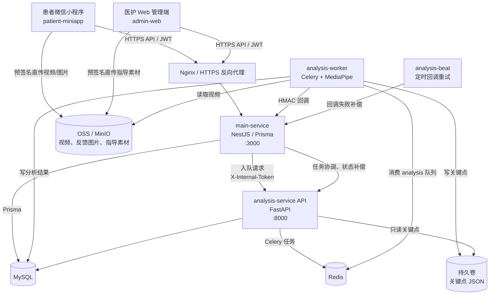
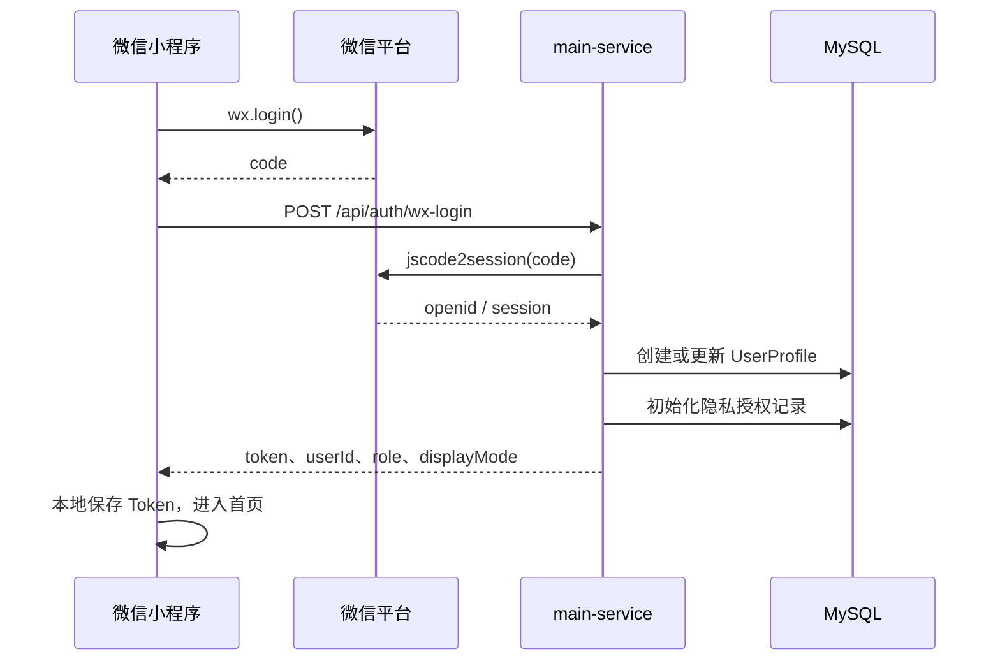
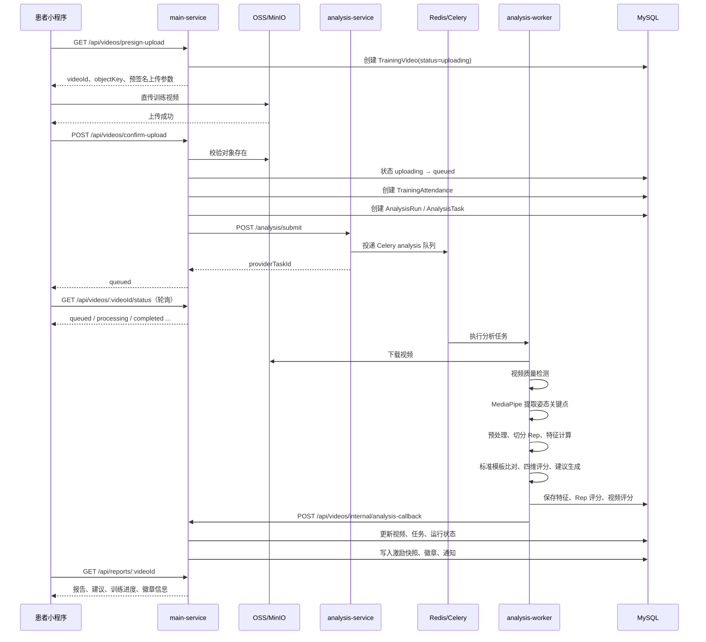
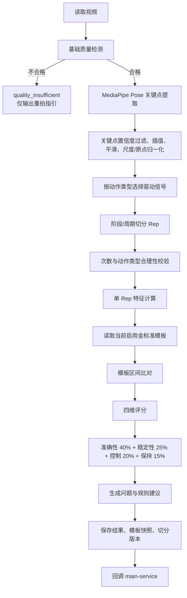
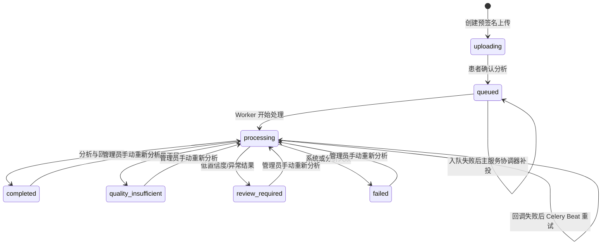
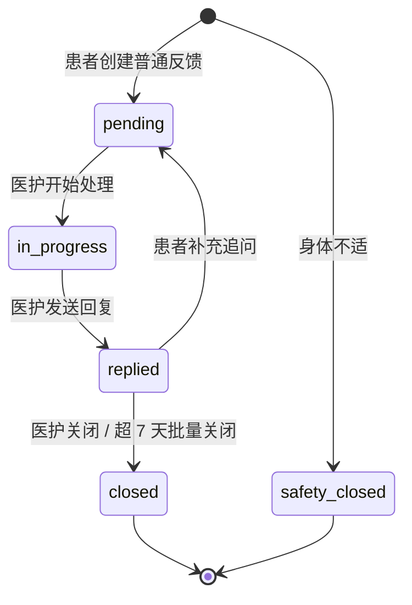
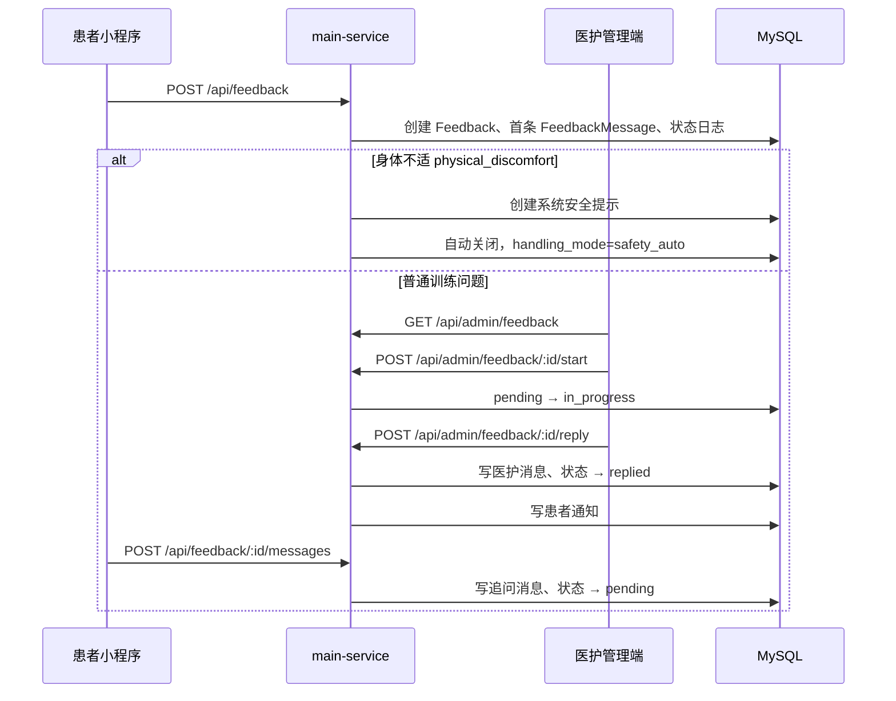

## 项目总览

这是一个面向居家腹部康复训练的 Monorepo，核心闭环为：

> 患者查看指导内容 → 上传训练视频 → 服务端异步姿态分析与评分 → 获取训练报告 → 反馈/通知/激励；医护通过 Web 管理内容、视频、人工复核和反馈工单。

技术组成：

| 层级 | 实现 | 职责 |
|---|---|---|
| 患者端 | 微信原生小程序 | 登录、指导、上传、报告、历史、反馈、通知、徽章 |
| 管理端 | Vue 3 + TypeScript + Element Plus | 内容管理、患者/视频管理、分析任务、人工复核、反馈、规则配置 |
| 业务主服务 | NestJS + Prisma + MySQL | 鉴权、业务状态机、OSS 签名、报告聚合、通知、激励、管理 API |
| 动作分析服务 | FastAPI + Celery + MediaPipe | 视频质量检测、关键点提取、动作切分、特征计算、评分、回调 |
| 基础设施 | MySQL + Redis + OSS/MinIO | 业务数据、异步队列、文件资产与关键点数据 |

主服务入口在 `services/main-service/src/main.ts`，所有 API 带统一前缀 `/api`。生产编排见 `infra/docker-compose.production.yml`。

---

## 项目架构图



### 关键部署隔离

- `main-service`：对外 API，生产仅绑定本机 `127.0.0.1:3000`，由 Nginx 转发。
- `admin-web`：静态站点，绑定 `127.0.0.1:8080`。
- `analysis-service`：仅作为内部服务，接收主服务的分析投递。
- `analysis-worker`：真正执行 CPU MediaPipe 推理，默认单并发，避免耗尽单机资源。
- Redis：
  - DB 0：主服务缓存/协调；
  - DB 1：Celery Broker；
  - DB 2：Celery Result Backend。
- 患者视频不经主服务传输，使用预签名 URL 直传对象存储。

---

## 核心业务流程图

### 1. 患者登录流程



管理端为账号密码登录：

```text
Admin Web
  → POST /api/admin/auth/login
  → scrypt 校验 AdminAccount.password_hash
  → 返回 JWT
  → 路由守卫按账号角色控制页面访问
```

---

### 2. 训练上传、异步分析、报告生成流程



### 3. 分析服务内部处理流程



动作覆盖：

- `abdominal_crunch`：缩腹运动；
- `pelvic_tilt`：骨盆倾斜；
- `knee_rotation`：膝关节旋转。

---

### 4. 分析状态与容错流程



可靠性机制：

1. **主服务补投**：`AnalysisReconciliationService` 定时扫描未成功投递或超时任务。
2. **分析侧回调重试**：Celery Beat 定期重试 `retry_pending` 回调。
3. **重复回调幂等**：通过 `videoId`、`analysisRunId`、`providerTaskId` 及状态迁移保护避免重复写报告、通知、徽章。
4. **终态不回退**：`completed`、`failed`、`quality_insufficient`、`review_required` 不接受旧任务的乱序回调。

---

### 5. 反馈工单流程





---

## 目录与模块职责

| 路径 | 职责 |
|---|---|
| `apps/patient-miniapp` | 患者微信小程序 |
| `apps/admin-web` | 医护/运营 Web 管理端 |
| `services/main-service` | NestJS 主业务服务 |
| `services/analysis-service` | FastAPI 分析 API、Celery Worker、算法核心 |
| `packages/shared-contract` | 前后端共享 DTO/接口契约 |
| `packages/shared-types` | 通用 TypeScript 类型 |
| `packages/shared-constants` | 状态、动作类型等共享常量 |
| `infra` | 本地/生产 Docker 编排 |
| `docs` | PRD、页面设计、算法与生产整改方案 |
| `gold_standard_output` | 三类动作的金标准产物/样例 |

---

# 实际 API 清单

所有主服务接口基路径为：

```text
/api
```

大部分患者接口需要患者 JWT；`admin/*` 需要管理端账号 JWT；分析服务接口需要内部令牌 `X-Internal-Token`。

## 一、认证与健康检查

| 方法 | 路径 | 调用方 | 用途 |
|---|---|---|---|
| POST | `/api/auth/mock-login/status` | 小程序开发环境 | 查询 mock 登录可用性 |
| POST | `/api/auth/mock-login` | 小程序开发环境 | mock 登录 |
| POST | `/api/auth/wx-login` | 患者小程序 | 微信 `code` 换取登录 JWT |
| POST | `/api/auth/wx-phone-login` | 患者小程序 | 微信手机号授权登录 |
| POST | `/api/admin/auth/login` | 管理端 | 管理账号密码登录 |
| GET | `/api/health` | 运维 | 基础健康检查 |
| GET | `/api/health/live` | Docker/K8s | 存活探针 |
| GET | `/api/health/ready` | Docker/K8s | 就绪探针 |

## 二、患者个人资料、隐私、徽章和配置

| 方法 | 路径 | 用途 |
|---|---|---|
| GET | `/api/me/profile` | 获取患者资料 |
| PUT | `/api/me/profile` | 编辑姓名、性别、年龄等资料 |
| POST | `/api/me/phone/bind` | 绑定微信手机号 |
| GET | `/api/me/display-settings` | 获取展示/辅助设置 |
| PUT | `/api/me/display-settings` | 更新展示设置 |
| GET | `/api/me/training-summary` | 首页训练汇总、连续训练、本周进度 |
| GET | `/api/me/badges` | 获取已获徽章 |
| POST | `/api/me/badges/:badgeCode/seen` | 标记徽章已查看 |
| GET | `/api/me/badge-wall` | 获取完整徽章墙与进度 |
| GET | `/api/me/app-config` | 获取患者端应用配置 |
| GET | `/api/me/privacy/consent` | 获取隐私授权状态 |
| POST | `/api/me/privacy/consent` | 授予隐私授权 |
| POST | `/api/me/privacy/withdraw-consent` | 撤回隐私授权 |

## 三、指导内容

| 方法 | 路径 | 调用方 | 用途 |
|---|---|---|---|
| GET | `/api/guidance` | 患者端 | 已启用指导内容列表 |
| GET | `/api/guidance/by-action/:actionType` | 患者端 | 按动作类型获取指导详情 |
| GET | `/api/guidance/:contentId` | 患者端 | 指定内容详情 |
| GET | `/api/guidance/assets?key=` | 患者端 | 代理指导素材读取 |
| GET | `/api/admin/guidance` | 管理端 | 指导内容管理列表 |
| POST | `/api/admin/guidance` | 管理端 | 新建指导内容 |
| GET | `/api/admin/guidance/:id` | 管理端 | 获取编辑详情 |
| PUT | `/api/admin/guidance/:id` | 管理端 | 修改内容 |
| DELETE | `/api/admin/guidance/:id` | 管理端 | 删除内容 |
| POST | `/api/admin/guidance/:id/enabled` | 管理端 | 上架/下架 |
| POST | `/api/admin/guidance/:id/copy` | 管理端 | 复制内容 |
| GET | `/api/admin/guidance/presign-upload` | 管理端 | 获取素材上传签名 |
| GET | `/api/admin/guidance/config-package` | 管理端 | 导出指导内容配置包 |
| POST | `/api/admin/guidance/config-package/import` | 管理端 | 导入指导内容配置包 |
| POST | `/api/assets/upload` | 管理端 | 服务端转存素材上传兼容接口 |

## 四、训练视频与分析任务

| 方法 | 路径 | 用途 |
|---|---|---|
| GET | `/api/videos/presign-upload` | 创建训练视频记录并获得 OSS 上传凭证 |
| POST | `/api/videos/:videoId/upload` | 服务端接收训练视频的兼容上传方式 |
| POST | `/api/videos/confirm-upload` | 校验上传对象、确认训练并发起分析 |
| GET | `/api/videos/:videoId/status` | 查询患者视频分析状态 |
| GET | `/api/videos/admin/internal-samples/:sourceType/presign-upload` | 管理端内部样本上传凭证 |
| POST | `/api/videos/admin/internal-samples/:videoId/upload` | 上传内部验证样本 |
| POST | `/api/videos/admin/internal-samples/:videoId/confirm-upload` | 确认内部样本分析 |
| GET | `/api/videos/admin/internal-samples/:videoId/status` | 查询内部样本状态 |
| GET | `/api/videos/admin/analysis-health` | 管理端查看分析服务健康状态 |
| GET | `/api/videos/admin/dashboard-overview` | Dashboard 视频/任务概览 |
| GET | `/api/videos/admin/list` | 视频列表与筛选分页 |
| GET | `/api/videos/admin/tasks` | 分析任务列表 |
| POST | `/api/videos/admin/:videoId/reanalyze` | 手动重新分析 |
| GET | `/api/videos/admin/:videoId` | 视频详情 |
| GET | `/api/videos/admin/:videoId/analysis-detail` | 分析特征与评分详情 |
| GET | `/api/videos/admin/:videoId/keypoints` | 关键点/骨架可视化数据 |
| GET | `/api/videos/admin/:videoId/manual-review` | 获取人工复核结果 |
| POST | `/api/videos/admin/:videoId/manual-review` | 提交人工复核 |
| POST | `/api/videos/internal/analysis-callback` | 分析服务内部回调，不对患者端开放 |

## 五、报告、历史与通知

| 方法 | 路径 | 用途 |
|---|---|---|
| GET | `/api/reports/:videoId` | 获取患者报告：评分、建议、进度、徽章、人工复核状态 |
| GET | `/api/history/videos` | 获取本人训练历史 |
| GET | `/api/notifications` | 通知列表 |
| GET | `/api/notifications/unread-count` | 未读数量 |
| PATCH | `/api/notifications/:notificationId/read` | 标记单条已读 |
| POST | `/api/notifications/:notificationId/read` | 兼容的标记单条已读接口 |
| POST | `/api/notifications/read-all` | 全部标记已读 |

## 六、患者反馈与医护反馈处理

| 方法 | 路径 | 用途 |
|---|---|---|
| GET | `/api/feedback/presign-upload` | 获取反馈图片上传凭证 |
| POST | `/api/feedback/upload-image` | 反馈图片服务端上传兼容接口 |
| POST | `/api/feedback` | 创建反馈工单 |
| GET | `/api/feedback` | 获取本人反馈列表 |
| GET | `/api/feedback/:feedbackId` | 获取工单详情、消息、状态日志 |
| POST | `/api/feedback/:feedbackId/messages` | 患者追问/补充消息 |
| GET | `/api/admin/feedback` | 医护普通工单队列 |
| GET | `/api/admin/feedback/safety-records` | 身体不适安全留档 |
| GET | `/api/admin/feedback/reply-templates` | 回复模板 |
| GET | `/api/admin/feedback/:feedbackId` | 工单详情 |
| POST | `/api/admin/feedback/:feedbackId/start` | 开始处理 |
| POST | `/api/admin/feedback/:feedbackId/reply` | 发送医护回复 |
| POST | `/api/admin/feedback/:feedbackId/close` | 关闭工单 |
| POST | `/api/admin/feedback/batch-close` | 批量关闭长期无追问工单 |

## 七、账号、患者、阈值、模板和系统配置

| 方法 | 路径 | 用途 |
|---|---|---|
| GET | `/api/admin/accounts` | 管理账号列表 |
| POST | `/api/admin/accounts` | 新建管理账号 |
| PATCH | `/api/admin/accounts/:accountId` | 更新角色、状态等 |
| PATCH | `/api/admin/accounts/:accountId/password` | 重置密码 |
| DELETE | `/api/admin/accounts/:accountId` | 删除账号 |
| GET | `/api/admin/patients` | 患者列表 |
| GET | `/api/admin/patients/:patientId` | 患者详情 |
| GET | `/api/admin/thresholds` | 获取动作阈值 |
| PUT | `/api/admin/thresholds` | 更新阈值配置 |
| GET | `/api/admin/thresholds/gold-templates/source-videos` | 金标准源视频列表 |
| GET | `/api/admin/thresholds/gold-templates` | 金标准模板版本列表 |
| POST | `/api/admin/thresholds/gold-templates/generate` | 从样本生成模板 |
| POST | `/api/admin/thresholds/gold-templates` | 保存模板 |
| GET | `/api/admin/thresholds/gold-templates/:templateId` | 模板详情 |
| PUT | `/api/admin/thresholds/gold-templates/:templateId/status` | 启用/停用模板 |
| PUT | `/api/admin/thresholds/gold-templates/:templateId/archive` | 归档模板 |
| DELETE | `/api/admin/thresholds/gold-templates/:templateId` | 删除模板 |
| GET | `/api/admin/thresholds/motivation-rules` | 获取激励规则 |
| PUT | `/api/admin/thresholds/motivation-rules` | 更新激励规则 |
| GET | `/api/admin/thresholds/patient-app-config` | 获取患者端配置 |
| PUT | `/api/admin/thresholds/patient-app-config` | 更新患者端配置 |

## 八、分析服务内部 API

分析服务默认运行在 `:8000`，路由由 `services/analysis-service/app/api/analysis.py` 提供。

| 方法 | 路径 | 用途 |
|---|---|---|
| GET | `/` | 服务根信息 |
| GET | `/health` | 健康检查 |
| GET | `/health/live` | 存活检查 |
| GET | `/health/ready` | 就绪检查 |
| POST | `/analysis/submit` | 主服务投递分析任务 |
| GET | `/analysis/status?video_id=` | 查询任务状态 |
| GET | `/analysis/keypoints?video_id=` | 获取骨架关键点数据 |
| GET | `/analysis/result?video_id=` | 获取分析完整结果 |

---

# 数据库表与字段含义

数据库 Schema 来源：`services/main-service/prisma/schema.prisma`。分析服务通过 SQLAlchemy 直接读写其中的分析相关表，映射位于 `services/analysis-service/app/db/models.py`。

## 1. 用户、账号、隐私与审计

### `user_profile`：患者及用户档案

| 字段 | 含义 |
|---|---|
| `user_id` | 用户主键 |
| `openid` | 微信唯一标识，唯一约束 |
| `name` | 姓名/昵称 |
| `gender` | 性别 |
| `age` | 年龄 |
| `phone` | 授权绑定手机号 |
| `phone_authorized_at` | 手机号授权时间 |
| `role` | 角色，默认 `patient` |
| `status` | 启用状态 |
| `display_mode` | 展示模式，默认 `elderly` |
| `created_at` / `updated_at` | 创建、更新时间 |

关系：

```text
UserProfile
 ├─ TrainingVideo
 ├─ TrainingAttendance
 ├─ TrainingMotivationSnapshot
 ├─ Feedback
 ├─ UserBadge
 ├─ Notification
 └─ PatientPrivacyConsent
```

索引：`role`。

### `admin_account`：管理端账号

| 字段 | 含义 |
|---|---|
| `account_id` | 主键 |
| `username` | 登录名，唯一 |
| `password_hash` | scrypt 密码哈希 |
| `display_name` | 显示名 |
| `role` | `admin` / `nurse` 等 |
| `status` | 启用状态 |
| `created_at` / `updated_at` | 创建、更新时间 |

### `patient_privacy_consent`：患者隐私授权

| 字段 | 含义 |
|---|---|
| `consent_id` | 主键 |
| `user_id` | 用户 ID，唯一，一对一 |
| `policy_version` | 患者同意的隐私政策版本 |
| `consented_at` | 同意时间 |
| `withdrawn_at` | 撤回时间 |
| `created_at` / `updated_at` | 创建、更新时间 |

### `sensitive_access_audit`：敏感数据访问审计

| 字段 | 含义 |
|---|---|
| `audit_id` | 主键 |
| `actor_account_id` | 访问者管理账号 |
| `actor_role` | 操作者角色 |
| `action` | 操作，例如查看视频、导出数据 |
| `resource_type` / `resource_id` | 被访问资源类型与 ID |
| `patient_id` | 关联患者 |
| `request_ip` / `user_agent` | 请求来源信息 |
| `result` | 操作结果 |
| `created_at` | 审计发生时间 |

关键索引：`patient_id + created_at`、`actor_account_id + created_at`。

---

## 2. 指导内容与版本

### `guidance_content`：动作指导正文

| 字段 | 含义 |
|---|---|
| `content_id` | 指导内容 ID |
| `action_type` | 动作类型 |
| `title` | 标题 |
| `brief_instruction` | 面向患者的一句话说明 |
| `description` | 内容介绍 |
| `video_key` / `video_url` | 教学视频对象键/访问地址 |
| `thumbnail_url` | 封面图 |
| `text_instruction` | 文字步骤说明 |
| `common_mistakes` | 常见错误文字 |
| `shooting_requirement` | 拍摄要求文字 |
| `step_images` | 步骤图片 JSON |
| `shooting_guide_images` | 拍摄示意图 JSON |
| `common_mistake_images` | 常见错误图片/GIF JSON |
| `status` | 内容状态/是否启用 |
| `version` | 当前编辑版本 |
| `published_version` | 当前发布版本 |
| `draft_snapshot` | 草稿快照 |
| `created_by` / `updated_by` | 创建、更新操作者 |
| `created_at` / `updated_at` | 创建、更新时间 |

索引：`action_type`。

### `guidance_content_version`：内容历史版本

| 字段 | 含义 |
|---|---|
| `version_id` | 主键 |
| `content_id` | 所属指导内容 |
| `version` | 版本号 |
| `snapshot` | 该版本完整 JSON 快照 |
| `created_by` | 创建人 |
| `created_at` | 创建时间 |

唯一约束：`(content_id, version)`。

---

## 3. 训练视频、分析运行与异步任务

### `training_video`：患者上传视频

| 字段 | 含义 |
|---|---|
| `video_id` | 视频主键 |
| `user_id` | 上传患者 |
| `action_type` | 选择的训练动作 |
| `source_type` | 视频来源，例如患者上传、内部样本 |
| `video_key` | 原始视频对象存储 Key |
| `video_key_720p` | 转码后的 720P Key |
| `duration` | 时长 |
| `resolution` | 分辨率 |
| `upload_time` | 上传创建时间 |
| `confirmed_at` | 患者确认进入分析的时间 |
| `analysis_status` | 分析状态 |
| `quality_status` | 视频质量状态 |
| `quality_score` | 视频质量评分 |
| `quality_issues` | 质量问题 JSON |
| `fail_reason` | 失败原因 |
| `model_version` | 使用的模型版本 |
| `created_at` / `updated_at` | 创建、更新时间 |

关键状态通常为：

```text
uploading → queued → processing
→ completed | quality_insufficient | review_required | failed
```

索引：`user_id`、`analysis_status`。

### `analysis_task`：视频当前分析任务状态

| 字段 | 含义 |
|---|---|
| `task_id` | 主键 |
| `video_id` | 对应视频，唯一，即每视频一条当前任务 |
| `provider_task_id` | Celery/分析提供方任务 ID |
| `analysis_run_id` | 当前分析运行 ID |
| `task_status` | 当前任务状态 |
| `retry_count` | 自动补投重试次数 |
| `manual_retry_count` | 管理员手动重分析次数 |
| `fail_reason` | 异常原因 |
| `callback_status` | 回调状态 |
| `callback_attempt_count` | 回调尝试次数 |
| `callback_last_error` | 最近回调错误 |
| `callback_next_retry_at` | 下次回调重试时间 |
| `callback_payload` | 待回调结果快照 |
| `callback_url` | 回调地址 |
| `started_at` / `finished_at` | 任务开始/结束时间 |
| `created_at` / `updated_at` | 创建、更新时间 |

### `analysis_run`：一次独立分析运行

用于保留每次投递或重新分析的运行层上下文。

| 字段 | 含义 |
|---|---|
| `analysis_run_id` | UUID 主键 |
| `video_id` | 视频 ID |
| `provider_task_id` | 分析服务任务 ID |
| `status` | 本次运行状态 |
| `request_snapshot` | 调用分析服务时的请求快照 |
| `algorithm_version` | 算法版本 |
| `template_version` | 金标准模板版本 |
| `threshold_version` | 阈值版本 |
| `fail_reason` | 失败原因 |
| `started_at` / `finished_at` | 起止时间 |
| `created_at` / `updated_at` | 创建、更新时间 |

索引：`video_id + created_at`、`status`。

---

## 4. 金标准模板、特征与评分结果

### `standard_action_template`：金标准动作模板

| 字段 | 含义 |
|---|---|
| `template_id` | 主键 |
| `action_type` | 动作类型 |
| `version` | 模板版本 |
| `description` | 模板说明 |
| `reference_stats` | 特征参考统计值，例如均值、分位区间、有效范围 |
| `threshold_config` | 评分阈值配置 |
| `status` | `0` 停用、`1` 启用、`2` 归档 |
| `version_type` | 模板类型，默认 `gold_template` |
| `parent_template_id` | 来源父版本 |
| `change_summary` | 变更摘要 |
| `change_diff` | 配置差异 JSON |
| `ever_activated` | 是否曾启用 |
| `created_by` / `created_at` | 创建人、创建时间 |

唯一约束：`(action_type, version)`。  
索引：`action_type + status`、`parent_template_id`。

### `motion_feature_result`：每视频/每动作周期的特征值

| 字段 | 含义 |
|---|---|
| `id` | 主键 |
| `video_id` | 所属视频 |
| `rep_id` | 动作周期 ID，可为空表示视频级特征 |
| `feature_code` | 特征编码，例如幅度、稳定性、保持时间 |
| `feature_value` | 特征数值 |
| `unit` | 单位 |
| `confidence` | 特征可信度 |
| `compare_label` | 模板比较标签，如 normal/warning/invalid |
| `deviation_sigma` | 相对模板偏差 |
| `created_at` | 创建时间 |

### `rep_evaluation_result`：单次动作周期评分

| 字段 | 含义 |
|---|---|
| `id` | 主键 |
| `video_id` | 视频 ID |
| `rep_id` | 第几次动作 |
| `accuracy_score` | 准确性评分 |
| `stability_score` | 稳定性评分 |
| `control_score` | 控制性评分 |
| `duration_score` | 保持时长评分 |
| `total_score` | 单次综合评分 |
| `grade` | 单次等级 |
| `valid_flag` | 是否视为有效动作 |
| `compensation_types` | 代偿类型 JSON |
| `hold_duration` | 顶点保持时长 |
| `created_at` | 创建时间 |

### `video_evaluation_result`：视频级综合报告结果

以 `video_id` 为主键，一条视频一份当前结果。

| 字段 | 含义 |
|---|---|
| `video_id` | 视频 ID，同时是主键 |
| `total_reps` | 识别到的总动作次数 |
| `valid_reps` | 有效次数 |
| `average_score` | 平均/综合分 |
| `grade` | 评级 |
| `accuracy_avg` | 准确性均分 |
| `stability_avg` | 稳定性均分 |
| `control_avg` | 控制性均分 |
| `duration_avg` | 保持均分 |
| `avg_hold_duration` | 平均保持时长 |
| `main_issues` | 主要问题 JSON |
| `advice_summary` | 面向患者的建议 JSON |
| `confidence_score` | 整体置信度 |
| `analysis_version` | 分析算法版本 |
| `template_id` / `template_version` | 实际使用的模板来源 |
| `threshold_snapshot` | 本次使用的阈值快照 |
| `segmentation_version` | 动作切分算法版本 |
| `segmentation_snapshot` | 切分结果与诊断快照 |
| `created_at` | 创建时间 |

### `manual_video_review`：人工复核

| 字段 | 含义 |
|---|---|
| `review_id` | 主键 |
| `video_id` | 视频 ID，唯一 |
| `algorithm_*` | 算法原始结论快照 |
| `accuracy_judgment` | 人工准确性判断 |
| `disposition` | 复核处置结果 |
| `use_manual_result` | 是否以人工结论覆盖算法结果 |
| `manual_score` / `manual_grade` | 人工评分与等级 |
| `manual_main_issues` | 人工主要问题 |
| `manual_advice` | 人工建议 |
| `review_note` | 内部复核备注 |
| `reviewer_account_id` / `reviewer_name` | 复核人 |
| `reviewed_at` / `updated_at` | 复核、更新时间 |

---

## 5. 反馈工单

### `feedback`：反馈工单主表

| 字段 | 含义 |
|---|---|
| `feedback_id` | 工单 ID |
| `user_id` | 患者 ID |
| `video_id` | 关联训练视频，可为空 |
| `feedback_type` | 反馈类型 |
| `content` | 首次问题正文 |
| `image_urls` | 首次问题图片 JSON |
| `status` | `pending` / `in_progress` / `replied` / `closed` |
| `priority_level` | 普通/高优先级 |
| `handling_mode` | `manual` 或 `safety_auto` |
| `last_message_at` | 最后一条消息时间 |
| `first_replied_at` | 首次人工回复时间 |
| `closed_at` | 关闭时间 |
| `closed_by` | 关闭者，账号或 system |
| `close_reason` | 关闭原因 |
| `created_at` / `updated_at` | 创建、更新时间 |

索引：

- `user_id`；
- `status + last_message_at`，用于待办排序；
- `handling_mode + status`，用于安全分流记录筛选。

### `feedback_message`：工单消息流

| 字段 | 含义 |
|---|---|
| `message_id` | 主键 |
| `feedback_id` | 所属工单 |
| `sender_role` | `patient` / `staff` / `system` |
| `sender_id` | 发送人 ID，系统消息可空 |
| `message_type` | 文本、安全提示、状态变更等 |
| `content` | 内容 |
| `image_urls` | 图片 JSON |
| `template_code` | 使用的标准回复模板编号 |
| `created_at` | 创建时间 |

### `feedback_status_log`：反馈状态审计

| 字段 | 含义 |
|---|---|
| `log_id` | 主键 |
| `feedback_id` | 工单 ID |
| `from_status` / `to_status` | 状态迁移前后值 |
| `operator_role` | 患者、医护、系统 |
| `operator_id` | 操作人 |
| `reason` | 状态迁移原因 |
| `created_at` | 创建时间 |

### `feedback_reply`：兼容历史一问一答的回复表

| 字段 | 含义 |
|---|---|
| `reply_id` | 主键 |
| `feedback_id` | 反馈工单 |
| `replier_account_id` | 回复管理账号 |
| `reply_content` | 回复内容 |
| `created_at` | 创建时间 |

---

## 6. 训练激励、徽章、通知和系统配置

### `training_attendance`：训练出勤记录

| 字段 | 含义 |
|---|---|
| `attendance_id` | 主键 |
| `user_id` | 患者 |
| `video_id` | 对应视频，唯一 |
| `training_date` | 训练日期 |
| `counted_for_training_day` | 是否计入训练日 |
| `counted_at` | 记账时间 |
| `created_at` | 创建时间 |

作用：确认上传时就计入训练，坚持与分析评分解耦。

### `training_motivation_snapshot`：本次报告的激励快照

| 字段 | 含义 |
|---|---|
| `snapshot_id` | 主键 |
| `user_id` / `video_id` | 用户、视频 |
| `training_count_after` | 训练次数累计值 |
| `training_days_after` | 训练天数累计值 |
| `consecutive_training_days_after` | 连续训练天数 |
| `weekly_training_days_after` | 本周训练天数 |
| `qualified_count_after` | 合格累计数 |
| `improvement_level` | 进步程度 |
| `improvement_type` | 进步维度，如分数、稳定性、保持时间、次数 |
| `improvement_message` | 面向患者的进步文案 |
| `newly_unlocked_badge_codes` | 当次解锁徽章 |
| `stage` | 当前阶段 |
| `created_at` | 创建时间 |

### `badge_definition`：徽章定义

| 字段 | 含义 |
|---|---|
| `badge_id` | 主键 |
| `badge_code` | 唯一徽章编码 |
| `title` | 名称 |
| `description` | 说明 |
| `trigger_rule` | 触发规则 JSON |
| `status` | 启用状态 |
| `created_at` | 创建时间 |

当前主要徽章：

```text
first_try
streak_3
streak_7
days_30
days_60
days_90
first_excellent
```

### `user_badge`：患者已获徽章

| 字段 | 含义 |
|---|---|
| `user_badge_id` | 主键 |
| `user_id` | 用户 |
| `badge_id` | 徽章 |
| `awarded_at` | 获得时间 |
| `source_video_id` | 触发该徽章的视频 |
| `notified_at` | 通知时间 |
| `seen_at` | 患者查看时间 |
| `meta` | 附加信息 JSON |

唯一约束：`(user_id, badge_id)`，确保不重复发奖。

### `notification`：站内通知

| 字段 | 含义 |
|---|---|
| `notification_id` | 主键 |
| `user_id` | 接收患者 |
| `notification_type` | 通知类型 |
| `title` / `content` | 标题、正文 |
| `related_id` | 关联业务 ID |
| `dedupe_key` | 去重键，唯一 |
| `read_flag` | 是否已读 |
| `created_at` / `updated_at` | 创建、更新时间 |

常见通知：分析完成、徽章获得、反馈回复等。

### `system_config`：系统可配置项

| 字段 | 含义 |
|---|---|
| `config_id` | 主键 |
| `config_key` | 配置键，唯一 |
| `config_value` | JSON 配置值 |
| `description` | 配置说明 |
| `created_at` / `updated_at` | 创建、更新时间 |

用途包括：

- 动作阈值；
- 金标准模板相关配置；
- 激励规则；
- 患者端应用配置。

---

## 主要实现现状与设计差异

### 已完成的关键能力

- 微信登录、手机号授权、管理端账号登录；
- 指导内容维护、素材上传、启停、版本快照；
- 预签名视频上传、确认分析、异步分析和状态轮询；
- MediaPipe CPU 姿态分析、动作切分、模板比对、四维规则评分；
- 低质量视频降级、人工复核、管理员重新分析；
- 患者报告、历史记录、站内通知；
- 训练坚持统计、进步快照、7 类徽章；
- 多轮反馈工单、安全分流、医护回复模板、批量关闭；
- 生产部署的 Redis、Worker、Beat、只读文件系统、健康检查和资源限制。

### 当前主要差距

1. **患者小程序没有设计稿中的 TabBar 四栏结构**  
   `app.json` 目前无 `tabBar`，采用普通页面跳转。

2. **录制/上传确认的页面边界与设计稿不同**  
   当前上传与确认分析主要分布在 `pages/upload/index` 和 `pages/analyzing/index`，不是严格独立的录制页、上传确认页。

3. **通知只实现站内通知**  
   未见微信订阅消息/服务通知的完整接入。

4. **生产安全能力仍需补齐**  
   包括登录限流、账号锁定、MFA/SSO、文件头/容器格式校验、数据保留与删除策略、指标追踪与告警等。

5. **二期智能能力尚未实现**  
   当前是规则+模板评分；监督学习、长期聚类、个体化基线等仍属于规划能力。