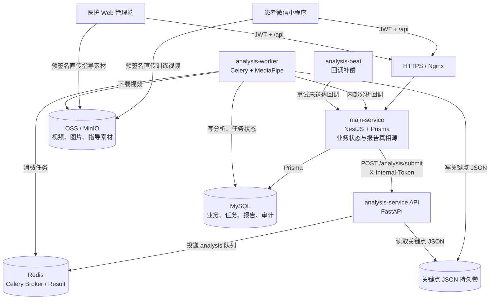
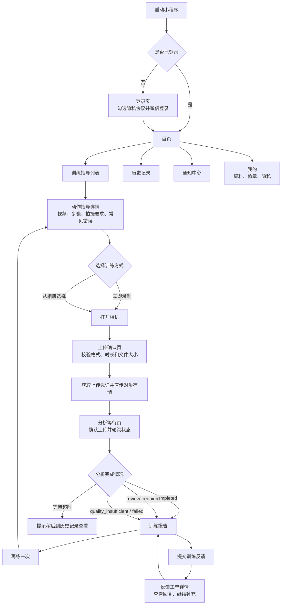
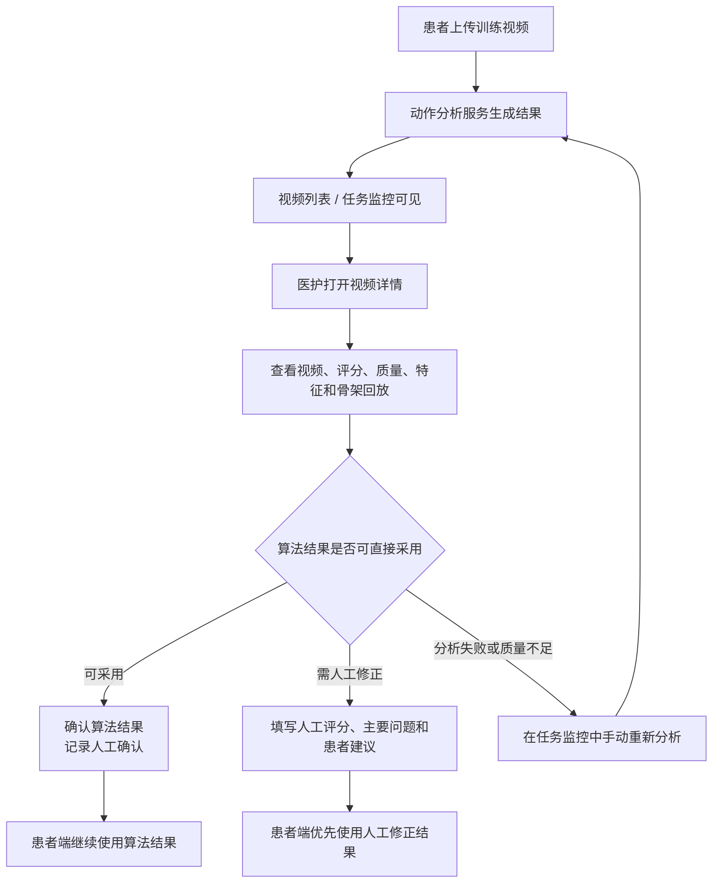
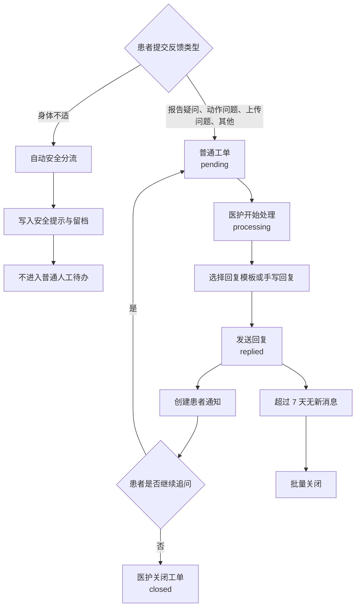
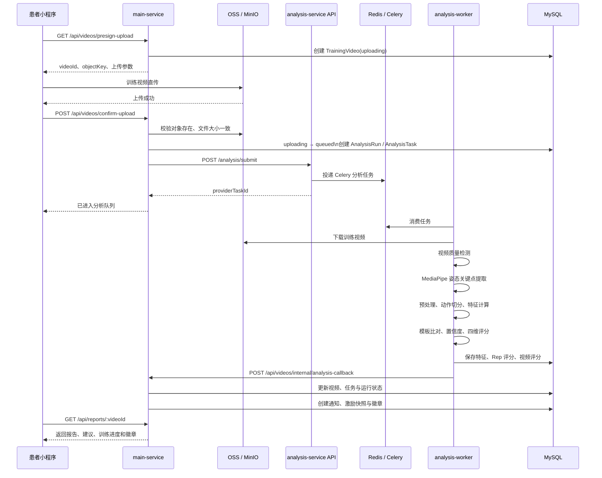
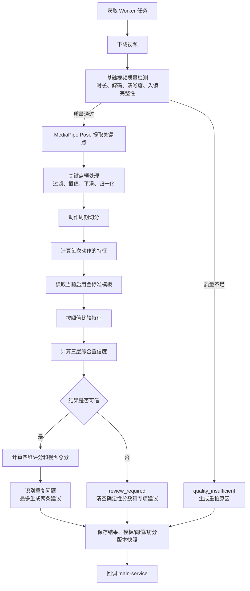
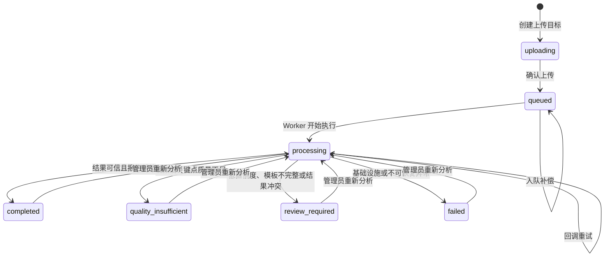
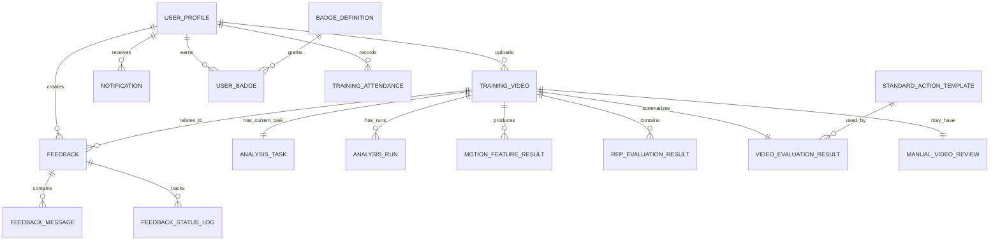

# Home Rehab Motion 项目架构与流程梳理

> **文档目的**：基于当前仓库代码梳理系统定位、模块职责、数据流、业务交互和动作分析评分逻辑。  
> **代码基线**：`main` 分支当前实现。  
> **说明**：本文以代码为准；历史 PRD、设计稿与部署文档仅用于补充业务背景，若有冲突应以实际实现为准。

---

## 1. 项目是什么

Home Rehab Motion 是一个面向居家腹部康复训练的系统。患者通过微信小程序学习标准动作、上传训练视频并查看分析报告；医护人员通过 Web 管理端维护教学内容、查看患者训练记录、复核异常视频、处理反馈工单，并管理评分模板和阈值。

系统的核心闭环是：

```text
患者查看动作指导
  → 录制或选择训练视频
  → 视频直传对象存储
  → 服务端确认上传并创建异步分析任务
  → 动作分析服务完成质量检测、姿态识别、动作切分与评分
  → 主服务生成患者报告、训练激励和通知
  → 患者查看结果；有疑问时提交反馈工单
  → 医护处理反馈或进行人工复核
```

### 1.1 当前支持的动作

| 动作代码 | 患者端名称 | 主要分析目标 |
|---|---|---|
| `abdominal_crunch` | 缩腹运动 | 收腹幅度、躯干稳定、控制速度、保持时间 |
| `pelvic_tilt` | 骨盆倾斜 | 骨盆倾斜幅度、骨盆偏移、躯干稳定、保持时间 |
| `knee_rotation` | 膝关节旋转 | 膝部旋转幅度、左右对称性、旋转节奏、躯干稳定 |

### 1.2 系统角色

| 角色 | 使用端 | 核心能力 |
|---|---|---|
| 患者 | 微信小程序 | 登录、查看指导、上传视频、查看报告与历史、接收通知、提交反馈、查看徽章和训练进度 |
| 护士 / 医护人员 | Web 管理端 | 查看患者与训练视频、查看分析结果、处理普通反馈工单、人工复核结果、维护指导内容 |
| 管理员 | Web 管理端 | 覆盖医护能力，并可操作内部样本、金标准提模、部分高风险阈值治理与系统配置 |
| 动作分析服务 | 内部服务 | 视频质量检测、人体关键点提取、动作切分、特征计算、模板比对、评分、结果持久化和回调 |

---

## 2. 项目组成与模块职责

### 2.1 Monorepo 目录结构

| 路径 | 技术栈 | 职责 |
|---|---|---|
| `apps/patient-miniapp` | 原生微信小程序 | 患者端界面与交互 |
| `apps/admin-web` | Vue 3、Vite、Element Plus、Vue Router | 医护/管理端 Web 应用 |
| `services/main-service` | NestJS、Prisma、MySQL | 对外业务 API、鉴权、业务状态机、报告与通知编排 |
| `services/analysis-service` | FastAPI、Celery、MediaPipe、OpenCV | 异步视频动作分析服务 |
| `packages/shared-types` | TypeScript | 共享业务类型、状态和枚举 |
| `packages/shared-contract` | TypeScript | 前后端共享 DTO 和接口契约 |
| `packages/shared-constants` | TypeScript | API 前缀和中文状态标签等共享常量 |
| `infra` | Docker Compose | 本地依赖与生产容器编排 |
| `scripts` | Shell / Node 脚本 | 发布、部署和辅助操作 |
| `gold_standard_output` | 分析产物 | 三类动作的金标准样例产物 |

### 2.2 服务职责边界

| 服务 | 主要职责 | 不负责的内容 |
|---|---|---|
| `main-service` | 用户和管理员鉴权、视频上传协调、训练/反馈业务状态、报告聚合、通知、徽章、激励、人工复核、管理端 API | 不直接执行 MediaPipe 姿态推理 |
| `analysis-service API` | 接收主服务内部投递、查询任务/结果/关键点、将任务写入 Celery 队列 | 不直接面向患者或管理端开放 |
| `analysis-worker` | 下载视频、质检、关键点提取、动作切分、计算评分、写入分析结果、回调主服务 | 不处理患者界面和业务通知 |
| `analysis-beat` | 定期重试未成功送达的分析回调 | 不重复执行完整的视频分析 |

---

## 3. 整体系统架构图



### 3.1 基础设施与数据职责

| 组件 | 主要用途 | 数据定位 |
|---|---|---|
| MySQL | 用户、视频、任务、分析结果、报告、工单、通知、审计、配置 | **业务最终真相源** |
| Redis DB 0 | 主服务的短期缓存/协调用途 | 非最终业务状态 |
| Redis DB 1 | Celery Broker | 分析任务消息队列 |
| Redis DB 2 | Celery Result Backend | Celery 任务结果 |
| OSS / MinIO | 患者训练视频、反馈图片、指导视频与图片 | 二进制对象资产 |
| Keypoints 持久卷 | 姿态关键点 JSON | 供骨架回放和分析结果查看 |

---

## 4. 患者端功能与页面交互

### 4.1 患者端功能地图

| 页面 | 页面路径 | 主要能力 |
|---|---|---|
| 登录页 | `pages/auth/login` | 微信登录、隐私协议确认 |
| 首页 | `pages/index/index` | 今日训练状态、快速入口、本周训练、旅程阶段、最近记录、通知提醒 |
| 训练指导列表 | `pages/guidance/index` | 浏览和筛选三类动作指导内容 |
| 动作指导详情 | `pages/guidance/detail` | 教学视频、图文步骤、拍摄要求、常见错误、录制/相册入口 |
| 上传确认 | `pages/upload/index` | 选择视频、格式/时长/大小校验、预签名上传 |
| 分析等待 | `pages/analyzing/index` | 确认上传、显示分析阶段、轮询视频状态、失败/待复核提示 |
| 训练报告 | `pages/report/index` | 分数、等级、有效次数、四维表现、建议、徽章、视频回放、反馈入口 |
| 历史记录 | `pages/history/index` | 查看历史视频、按状态进入报告/分析页/重传路径 |
| 通知中心 | `pages/notifications/index` | 分析完成、反馈回复、徽章解锁通知及深链跳转 |
| 反馈提交 | `pages/feedback/submit` | 训练相关问题、文字与图片提交、身体不适安全分流 |
| 反馈详情 | `pages/feedback/detail` | 工单消息时间线、患者补充消息、关联报告跳转 |
| 我的 | `pages/mine/index` | 个人信息、训练概览、徽章、隐私、退出登录 |
| 个人资料 | `pages/mine/profile` | 修改昵称、性别、年龄，绑定微信手机号 |
| 徽章墙 | `pages/mine/badges` | 查看已解锁与未解锁徽章进度 |
| 隐私授权 | `pages/mine/privacy` | 查询、授予或撤回视频分析隐私授权 |

### 4.2 患者主交互流程图



### 4.3 患者上传和分析等待交互

| 阶段 | 患者操作 | 前端行为 | 后端行为 |
|---|---|---|---|
| 选择视频 | 录制或从相册选择 | 校验格式、时长、文件大小 | 无 |
| 获取上传凭证 | 点击上传 | 请求预签名信息 | 创建 `TrainingVideo`，状态为 `uploading` |
| 视频上传 | 小程序直传 | 直传 OSS/MinIO；上传完成后进入分析页 | 对象存储保存视频 |
| 确认分析 | 分析页自动触发 | 调用确认上传接口 | 校验对象存在和文件大小，创建 `AnalysisRun`、`AnalysisTask`，投递分析任务 |
| 等待分析 | 页面每 3 秒轮询 | 展示排队、质检、关键点提取、动作分析、报告生成等进度 | Worker 更新任务状态和进度阶段 |
| 结果进入 | 状态变为终态 | 成功或待复核跳报告；失败也进入报告页展示原因 | 主服务返回患者可见结果 |

---

## 5. 医护管理端功能与交互

### 5.1 管理端功能地图

| 功能模块 | 代表路由 | 主要能力 |
|---|---|---|
| 登录 | `/login` | 管理员账号密码登录，保存 Token 和角色 |
| 工作台 | `/dashboard` | KPI、训练趋势、状态分布、重点训练和待处理反馈 |
| 患者列表 | `/users` | 搜索、分页、查看患者基本情况 |
| 患者详情 | `/users/:patientId` | 患者资料、训练概览、评分趋势、训练记录 |
| 视频列表 | `/videos` | 按状态和关键词筛选训练视频 |
| 视频详情 | `/videos/:videoId` | 原始视频、评分结果、问题、质量信息、关键点骨架回放、人工复核 |
| 分析任务监控 | `/analysis-tasks` | 队列健康、排队/失败任务、自动补偿状态、手动重新分析 |
| 反馈列表 | `/feedback` | 普通待办队列、安全分流记录、批量关闭长期无追问工单 |
| 反馈详情 | `/feedback/:feedbackId` | 患者上下文、对话时间线、开始处理、模板回复、关闭工单 |
| 指导内容列表 | `/guidance` | 指导内容启用/下线、复制、删除、配置导入导出 |
| 指导内容编辑 | `/guidance/create`、`/guidance/:id/edit` | 编辑基础信息、教学视频、步骤、拍摄要求、常见错误和患者端预览 |
| 阈值管理 | `/thresholds` | 可视化或 JSON 方式调整评分阈值 |
| 金标准提模 | `/gold-templates` | 基于视频生成金标准模板并保存版本 |
| 模板版本治理 | `/template-versions` | 查看参数差异、派生调优、启用/停用/归档/删除版本 |
| 激励规则 | `/motivation-rules` | 管理进步判定阈值 |
| 患者端配置 | `/patient-config` | 管理视频限制、周目标和支持的动作类型 |
| 账号管理 | `/accounts` | 新增、编辑、启停、重置密码、删除管理账号 |
| 流程验证工具 | `/flow-verify` | 内部样本上传、分析闭环、切分诊断与骨架复核 |

### 5.2 医护视频复核流程



### 5.3 反馈工单流程



---

## 6. 视频上传、异步分析和报告生成流程



### 6.1 分析服务内部流程



---

## 7. 视频状态机与可靠性机制

### 7.1 患者可见状态机



### 7.2 状态含义与患者展示

| 状态 | 含义 | 患者是否看到确定性评分 | 患者主要操作 |
|---|---|---:|---|
| `uploading` | 上传目标已创建，视频仍在上传 | 否 | 等待上传或重新选择视频 |
| `queued` | 视频已确认，等待 Worker 执行 | 否 | 留在分析页或返回首页等待 |
| `processing` | Worker 正在分析视频 | 否 | 等待、稍后到历史记录查看 |
| `completed` | 分析成功且结果可信 | 是 | 查看报告、建议、进步和徽章 |
| `quality_insufficient` | 拍摄质量、入镜、关键点等不满足最低要求 | 否 | 根据具体原因重新拍摄 |
| `review_required` | 结果存在不确定性，需要人工复核 | 否 | 查看待复核说明，稍后查看结果 |
| `failed` | 分析或基础设施出现不可恢复错误 | 否 | 稍后查看或重新上传 |

### 7.3 可靠性与幂等控制

| 异常场景 | 当前实现的处理方式 |
|---|---|
| 上传成功后患者退出，未确认上传 | 主服务周期扫描仍处于 `uploading` 的视频；发现对象已存在则自动补确认和入队。 |
| 患者确认上传与后台恢复同时执行 | 使用条件更新抢占，确保只会创建一条当前有效的分析运行。 |
| 分析服务入队失败 | 状态记为 `enqueue_retry_pending`，由协调器按退避策略自动补投。 |
| Worker 重复消费或旧任务迟到 | 对比 `analysisRunId`、任务 ID 和终态，过期任务不能覆盖新结果。 |
| Worker 得到结果但回调失败 | 结果和回调 payload 均持久化；Worker 先同步重试，`analysis-beat` 再周期补偿。 |
| 回调重复到达 | 视频状态、通知去重键、徽章唯一约束、激励快照唯一约束共同保证幂等。 |
| 终态被旧任务回退 | `completed`、`failed`、`quality_insufficient`、`review_required` 不接受旧任务的中间状态覆盖。 |
| 模板缺失或可信度不足 | 进入 `review_required`，患者端不展示确定性分数和专项纠错建议。 |

---

## 8. 当前评分规则

### 8.1 评分总体原则

每一个切分出的动作周期（Rep）都会独立计算特征、与金标准模板比对、形成四维评分。视频总分为各 Rep 总分的平均值。

| 评分维度 | 默认权重 | 说明 |
|---|---:|---|
| 动作准确性 `accuracy` | 40% | 动作幅度、角度或活动范围是否达到要求 |
| 稳定性 `stability` | 25% | 躯干、骨盆等非目标区域是否保持稳定 |
| 动作控制 `control` | 20% | 动作速度、平滑度、左右协调性是否合理 |
| 保持时间 `duration` | 15% | 到达动作目标位置后是否稳定停留 |

如果某类动作没有某一个维度对应的特征，系统不会将该维度直接记为 0 分，而会将现有维度的权重重新归一化。

### 8.2 三类动作的实际特征

| 动作 | 特征字段 | 计算含义 | 评分维度 |
|---|---|---|---|
| 缩腹运动 | `abdominal_displacement` | 肩中点和髋中点三维屈曲信号的稳健幅度 | 准确性 |
| 缩腹运动 | `displacement_velocity` | 收缩至峰值过程中的速度 | 控制度 |
| 缩腹运动 | `hold_duration` | 峰值附近保持至少 85% 幅度的连续时长 | 保持时间 |
| 缩腹运动 | `trunk_angle_change` | 躯干相对起始位置的最大角度变化 | 稳定性 |
| 骨盆倾斜 | `pelvic_tilt_delta` | 左右髋连线在画面平面中的角度变化范围 | 准确性 |
| 骨盆倾斜 | `pelvis_shift` | 髋中点相对静息位置的最大横向偏移 | 稳定性 |
| 骨盆倾斜 | `trunk_angle_change` | 峰值附近额外躯干摆动 | 稳定性 |
| 骨盆倾斜 | `hold_duration` | 骨盆倾斜顶点的连续保持时长 | 保持时间 |
| 膝关节旋转 | `knee_rotation_angle` | 双膝中点相对休息位置的最大单向横向偏移 | 准确性 |
| 膝关节旋转 | `knee_symmetry` | 左右膝活动幅度的对称程度 | 控制度 |
| 膝关节旋转 | `rotation_velocity` | 膝部旋转过程的速度 | 控制度 |
| 膝关节旋转 | `trunk_angle_change` | 旋转期间躯干最大角度变化 | 稳定性 |

### 8.3 特征与金标准模板的比较

| 比较标签 | 判断含义 | 对该特征分数的影响 |
|---|---|---|
| `normal` | 指标处于正常范围 | 最低 85 分；越接近参考目标可越接近 100 分 |
| `warning` | 指标轻度偏离标准 | 从 80 分开始随偏差下降，最低不低于 60 分 |
| `invalid` | 指标明显偏离标准 | 从 50 分开始随偏差下降，最低可到 0 分 |
| `review_required` | 数值无效、模板不完整或无法可靠比较 | 不给确定性评分，结果转人工复核 |

模板支持以下阈值语义：

| 模式 | 适用指标 | 含义 |
|---|---|---|
| `two_sided` | 标准值附近最合理的指标 | 数值过高或过低都可能偏离要求 |
| `lower_bound` | 动作幅度等“越大越好”的指标 | 小于下限时视为不足 |
| `upper_bound` | 晃动、代偿、偏移等“越小越好”的指标 | 大于上限时视为异常 |

### 8.4 评分等级

| 视频或 Rep 总分 | 等级 |
|---:|---|
| ≥ 90 | 优秀 |
| 75–89.999… | 合格 |
| 60–74.999… | 需改进 |
| < 60 | 无效 |
| 模板不完整或数据不可靠 | 待复核 |

### 8.5 核心准确性保护

当准确性维度的关键特征被判为 `invalid` 时，即使稳定性或控制度较高，单个 Rep 总分也会被强制限制到 40 分以内。这用于避免“动作幅度基本没有完成，但其他指标正常”仍然获得高分。

---

## 9. 建议生成规则

### 9.1 建议生成原则

系统不直接根据单次动作的一次波动给患者下结论。只有同一类问题在多次动作中重复出现，才会成为整段视频的主要问题。

| 视频中总动作数 | 同一问题需要出现的最少次数 | 额外限制 |
|---:|---:|---|
| 0–1 次 | 不生成专项建议 | 数据不足 |
| 2–3 次 | 至少 2 次 | 判断为重复问题 |
| ≥ 4 次 | 至少 2 次 | 且占全部动作次数至少 25% |

其他限制：

- 单个 Rep 内同类问题只计一次；
- 问题按出现次数排序；
- 患者端最多展示前 2 条建议；
- 建议使用规则模板生成，不使用自由生成式文本；
- 结果待复核时清空确定性专项建议。

### 9.2 当前建议模板

| 规则编码 | 触发特征 | 患者端建议 |
|---|---|---|
| `ADV_TRUNK_STABILITY` | `trunk_angle_change` 多次为 `warning` 或 `invalid` | 上身有些晃动。下次可轻轻收紧腹部，让躯干尽量保持稳定。 |
| `ADV_PELVIS_SHIFT` | `pelvis_shift` 多次为 `warning` 或 `invalid` | 骨盆有额外滑动。下次可放慢速度，除目标倾斜外尽量减少骨盆偏移。 |
| `ADV_HOLD_DURATION` | `hold_duration` 多次为 `warning` 或 `invalid` | 在目标位置停留时间偏短。下次可在舒适的情况下多停一小会儿，再慢慢回到起始位置。 |
| `ADV_ABD_AMPLITUDE` | `abdominal_displacement` 多次为 `warning` 或 `invalid` | 收腹幅度可以再清楚一些。请在不憋气、不疼痛的前提下，缓慢向内收紧腹部。 |
| `ADV_PELVIC_TILT_RANGE` | `pelvic_tilt_delta` 多次为 `warning` 或 `invalid` | 骨盆前后倾幅度可以再明显一些。请在舒适范围内慢慢完成，不要用力过猛。 |
| `ADV_KNEE_ROTATION_RANGE` | `knee_rotation_angle` 多次为 `warning` 或 `invalid` | 左右旋转幅度有些不均匀。请在舒适范围内，平稳完成双向旋转。 |
| `ADV_KNEE_SYMMETRY` | `knee_symmetry` 多次为 `warning` 或 `invalid` | 左右两侧的旋转幅度有些不一样。下次可放慢速度，让两边尽量做得一样大。 |
| `ADV_KNEE_ROTATION_SPEED` | `rotation_velocity` 多次为 `warning` 或 `invalid` | 旋转速度有些不均匀。下次可适当放慢，左右两边用相近的速度完成。 |

---

## 10. 置信度与人工复核规则

### 10.1 综合置信度

系统会计算三层置信度：

\[
\text{综合置信度} = 0.40 \times VQS + 0.35 \times KCS + 0.25 \times PRS
\]

| 指标 | 权重 | 主要内容 |
|---|---:|---|
| 视频质量置信度 `VQS` | 40% | 关键区域可见度、视频帧数是否充足 |
| 关键点置信度 `KCS` | 35% | 关键点平均可见度、缺失率、轨迹平滑度 |
| 参数可信度 `PRS` | 25% | 动作周期切分情况、有效动作比例 |

| 综合置信度 | 置信度等级 | 患者结果策略 |
|---:|---|---|
| ≥ 0.75 | `high` | 可输出正式评分、等级和建议 |
| 0.55–0.749 | `medium` | 进入 `review_required`，不展示确定性结论 |
| < 0.55 | `low` | 进入 `review_required`，不展示确定性结论 |

### 10.2 最终结果安全门禁

| 触发条件 | 最终视频状态 | 患者端处理 |
|---|---|---|
| 视频质量明确不足 | `quality_insufficient` | 展示可执行的重拍原因，不展示分数和动作结论 |
| 金标准模板不完整 | `review_required` | 显示“结果待复核”，不展示确定性专项建议 |
| 综合置信度不是 `high` | `review_required` | 显示“结果待复核”，不展示确定性专项建议 |
| 视频质量存在不确定性 | `review_required` | 等待人工复核，避免将不稳定识别结果直接展示给患者 |
| 数据、模板、视频质量均可信 | `completed` | 显示分数、等级、有效次数和最多两条建议 |

核心原则：**系统只有在数据可靠时才提供动作结论；视频质量或分析可信度不足时，不把算法的不确定性归因于患者动作做错。**

---

## 11. 报告、训练坚持与激励

### 11.1 训练记录与评分解耦

| 概念 | 触发时间 | 是否依赖最终评分 |
|---|---|---:|
| 训练出勤 / 训练日 | 患者确认上传并发起分析后 | 否 |
| 有效动作次数 | 分析完成后 | 是 |
| 动作质量分数 | 分析可信且完成后 | 是 |
| 徽章与进步激励 | 分析完成后，由主服务按规则计算 | 部分依赖；例如首次训练与连续训练主要依赖出勤，首次优秀依赖评分 |

### 11.2 旅程阶段

患者可见的旅程阶段由训练坚持和康复时间表达，而不是由一次视频得分直接决定。

| 阶段代码 | 患者展示名称 | 含义 |
|---|---|---|
| `corrective` | 熟悉动作 | 训练初期，重点是学习动作和形成习惯 |
| `consolidation` | 稳定练习 | 已有一定训练积累，重点是保持节奏和动作稳定 |
| `incentive` | 坚持成长 | 已持续训练，重点是鼓励坚持和巩固进步 |

### 11.3 当前主要徽章

| 徽章代码 | 名称 | 典型触发条件 |
|---|---|---|
| `first_try` | 初次尝试 | 第一个训练日 |
| `streak_3` | 连续 3 天 | 连续训练 3 天 |
| `streak_7` | 连续 7 天 | 连续训练 7 天 |
| `days_30` | 坚持 30 天 | 累计训练 30 天 |
| `days_60` | 坚持 60 天 | 累计训练 60 天 |
| `days_90` | 坚持 90 天 | 累计训练 90 天 |
| `first_excellent` | 首次优秀 | 首次取得优秀训练报告 |

---

## 12. 关键 API 概览

所有 `main-service` 对外接口统一使用 `/api` 前缀。

### 12.1 患者端关键接口

| 功能 | 方法与路径 |
|---|---|
| 微信登录 | `POST /api/auth/wx-login` |
| 获取指导内容 | `GET /api/guidance`、`GET /api/guidance/:contentId`、`GET /api/guidance/by-action/:actionType` |
| 获取上传凭证 | `GET /api/videos/presign-upload` |
| 本地代理上传兼容 | `POST /api/videos/:videoId/upload` |
| 确认上传并创建任务 | `POST /api/videos/confirm-upload` |
| 查询分析状态 | `GET /api/videos/:videoId/status` |
| 获取训练报告 | `GET /api/reports/:videoId` |
| 获取训练历史 | `GET /api/history/videos` |
| 获取通知 | `GET /api/notifications`、`GET /api/notifications/unread-count` |
| 获取/更新资料 | `GET /api/me/profile`、`PUT /api/me/profile` |
| 获取训练摘要/徽章 | `GET /api/me/training-summary`、`GET /api/me/badge-wall` |
| 隐私授权 | `GET/POST /api/me/privacy/consent`、`POST /api/me/privacy/withdraw-consent` |
| 反馈工单 | `GET/POST /api/feedback`、`GET /api/feedback/:feedbackId`、`POST /api/feedback/:feedbackId/messages` |

### 12.2 管理端关键接口

| 功能 | 方法与路径 |
|---|---|
| 管理端登录 | `POST /api/admin/auth/login` |
| 患者列表与详情 | `GET /api/admin/patients`、`GET /api/admin/patients/:patientId` |
| Dashboard | `GET /api/videos/admin/dashboard-overview` |
| 视频列表与详情 | `GET /api/videos/admin/list`、`GET /api/videos/admin/:videoId` |
| 分析任务与健康状态 | `GET /api/videos/admin/tasks`、`GET /api/videos/admin/analysis-health` |
| 重新分析 | `POST /api/videos/admin/:videoId/reanalyze` |
| 骨架关键点 | `GET /api/videos/admin/:videoId/keypoints` |
| 人工复核 | `GET/POST /api/videos/admin/:videoId/manual-review` |
| 反馈管理 | `GET /api/admin/feedback`、`POST /api/admin/feedback/:feedbackId/start`、`POST /api/admin/feedback/:feedbackId/reply`、`POST /api/admin/feedback/:feedbackId/close` |
| 指导内容管理 | `/api/admin/guidance` 系列接口 |
| 阈值与模板治理 | `/api/admin/thresholds`、`/api/admin/thresholds/gold-templates` 系列接口 |
| 账号管理 | `/api/admin/accounts` 系列接口 |

### 12.3 分析服务内部接口

分析服务只供主服务内部调用，需携带 `X-Internal-Token`。

| 功能 | 方法与路径 |
|---|---|
| 投递分析任务 | `POST /analysis/submit` |
| 查询任务状态 | `GET /analysis/status?video_id=` |
| 获取完整分析结果 | `GET /analysis/result?video_id=` |
| 获取关键点数据 | `GET /analysis/keypoints?video_id=` |
| 健康检查 | `GET /health`、`GET /health/live`、`GET /health/ready` |

---

## 13. 核心数据模型关系



| 实体 | 作用 |
|---|---|
| `UserProfile` | 患者档案、微信标识、基础资料、角色和展示设置 |
| `AdminAccount` | 管理端独立账号、密码哈希、角色与状态 |
| `TrainingVideo` | 训练视频元数据、患者可见分析状态、质量状态、对象存储信息 |
| `AnalysisTask` | 当前任务状态、进度、自动/人工重试和回调补偿信息 |
| `AnalysisRun` | 每次独立分析运行，保留算法、模板、阈值版本快照 |
| `MotionFeatureResult` | 视频/Rep 的特征计算结果 |
| `RepEvaluationResult` | 每次动作周期的四维评分与是否有效 |
| `VideoEvaluationResult` | 整段视频的汇总分数、等级、建议、模板与切分溯源 |
| `ManualVideoReview` | 医护人工确认、修正、重拍建议和患者可见文案 |
| `StandardActionTemplate` | 金标准模板、阈值和版本治理信息 |
| `Feedback` / `FeedbackMessage` | 与某次训练关联的反馈工单与多轮消息 |
| `TrainingAttendance` | 每个视频确认分析后的训练出勤记录 |
| `TrainingMotivationSnapshot` | 完成分析时的激励和旅程阶段快照 |
| `BadgeDefinition` / `UserBadge` | 徽章规则和患者获得记录 |
| `Notification` | 站内通知及去重键 |
| `GuidanceContent` / `GuidanceContentVersion` | 指导内容、草稿、发布版本和快照 |
| `SystemConfig` | 患者端参数、激励规则和其他 JSON 配置 |

---

## 14. 部署与运行概览

### 14.1 生产环境拓扑

```text
患者小程序 / 管理端浏览器
        │ HTTPS
        ▼
宝塔 Nginx / 公网域名
        ├── /      → admin-web（127.0.0.1:8080）
        └── /api/  → main-service（127.0.0.1:3000）
                            │ 内部 HTTP
                            ▼
                     analysis-service（容器内部 :8000）
                            │ Redis DB 1
                            ▼
                     analysis-worker（单并发分析）
                     analysis-beat（回调重试）

业务容器通过宿主机或私网访问：MySQL、Redis、OSS。
```

### 14.2 本地启动要点

| 内容 | 方式 |
|---|---|
| 本地基础依赖 | `docker compose -f infra/docker-compose.local.yml up -d` 启动 MySQL、Redis、MinIO |
| 全栈本地服务 | `./start-local.sh` 启动主服务、分析 API、Worker、Beat 和管理端 |
| 快速开发模式 | `npm run dev` 启动 admin、main、analysis API |
| 小程序 | 使用微信开发者工具直接打开 `apps/patient-miniapp` |
| 类型检查 | `npm run typecheck` |

---

## 15. 当前实现的关键特点

| 方向 | 当前实现特点 |
|---|---|
| 状态可信性 | 主服务是患者可见业务状态的真相源；分析服务只负责分析和回调。 |
| 上传稳定性 | 使用预签名直传，避免患者视频经过业务主服务；同时有文件大小校验和未确认上传自动恢复。 |
| 分析可靠性 | 入队补偿、回调重试、任务对账、终态保护和幂等去重均已实现。 |
| 算法安全 | 低质量、低置信度、模板缺失或结果冲突时转人工复核，不输出确定性动作结论。 |
| 建议可解释性 | 建议基于特征阈值和重复问题触发，不使用不可追溯的自由生成文本。 |
| 患者体验 | 训练坚持与动作质量解耦；一次视频效果不佳不会抹除患者的训练行为。 |
| 医护运营 | 已具备视频复核、反馈双队列、安全分流、指导维护、模板与阈值治理能力。 |
| 结果溯源 | 分析结果保存算法版本、模板版本、阈值快照和切分版本，支持后续审计和回归分析。 |

---

## 16. 一句话总结

> Home Rehab Motion 是一个以“患者居家训练视频分析”为核心的康复训练闭环系统：患者端负责学习、上传、查看结果和反馈；主服务负责业务状态、报告、通知和激励；分析服务负责质量检测、姿态分析、动作评分与建议；管理端负责内容运营、异常处理、人工复核和规则治理。
